# Skyline Student Association Platform

**Jury preparation guide: tested, explained, basic to advanced**

One installable web app for a student club's **events, members and money**.

**Live site:** [oddoskyline.netlify.app](https://oddoskyline.netlify.app)

Prepared 11 October 2026 from the repository **github.com/oggigachad/odoo** (commit `d76b2b1`), the live site **oddoskyline.netlify.app** and the team's Full Project Report.
Stack: FastAPI, PostgreSQL 16, Redis 7, MinIO, Razorpay, React 19 + Vite, Docker, Caddy.

## What is inside

- [Part 0. The pitch and a 3-minute demo script](#part-0-the-pitch-and-the-demo)
- [Part 1. What we tested and what we found (15 findings, with fixes)](#part-1-what-we-tested-and-what-we-found)
- [Part 2. The screens, desktop and phone](#part-2-the-screens)
- [Part 3. Ten design diagrams drawn from the code](#part-3-design-diagrams)
- [Part 4. 113 jury questions with answers, from basic to advanced](#part-4-jury-questions-and-answers)
- [Part 5. Fix-before-demo checklist and numbers to remember](#part-5-before-the-demo-and-numbers-to-remember)
- [Appendix. Every API route, glossary](#appendix)
- [Running the project](#running-the-project) (quick start, configuration, demo data, tests, layout, deploying)

---

## Part 0. The pitch and the demo

### 30-second pitch

> A student club runs three jobs: **events, members and money**. Today that is a spreadsheet, cash at the door, a notebook and WhatsApp, so people miss events, money goes missing and nobody knows who owes what. Skyline is one installable web app for all three. Students sign up with a verified college e-mail and pay semester dues by UPI. Officers sell gala tickets online with member prices and seat limits, and check people in at the door in a second, even offline. Hoodies are ordered from a phone with real stock per size. The treasurer sees money in, money out and the balance, and exports eight reports. Seats, stock and money are protected inside PostgreSQL, so two phones can never buy the same last seat.

### 3-minute demo script

| Time | Show | Say |
| :--- | :--- | :--- |
| 0:00 | Landing page on a phone | "One app for a club's events, members and money. It installs like an app." |
| 0:20 | Create account | Only college or staff domains; a 6-digit code proves the inbox. Everyone starts as Guest. |
| 0:40 | Membership tab, pay | Choose semester and plan, pay with Razorpay; the role becomes Member only after the server verifies the signature. |
| 1:00 | Events, buy a gala ticket | Member price applied by the server; seat held 15 minutes; ticket PDF with a signed QR that is not a URL. |
| 1:30 | Check-In tab on a second phone | Scan: green Admitted with Member badge. Scan again: amber Already used. Mention offline mode. |
| 2:00 | Shop | Size stock, cart, member price; the Live Sync badge updates other screens without reloading. |
| 2:20 | Finance and Reports (Treasurer) | In by category, reimbursed out, balance; export Profit per event to PDF. |
| 2:45 | Close | "Rules that must never break live in the database: row locks and triggers. 44 automated tests, every role tested in a browser." |

### Accounts to have ready

One per role (Admin, Treasurer, Officer, Member, Guest). `python -m scripts.role_accounts` creates them and prints passwords once; keep them off the slides. Have a paid ticket ready for the door demo and Razorpay in test mode (test card or UPI `success@razorpay`).

---

## Part 1. What we tested and what we found

Everything below was run on **11 October 2026** against commit `d76b2b1` of `github.com/oggigachad/odoo`.

| 44 / 44 | 80 / 83 | 70 / 70 | 32 / 32 |
| :---: | :---: | :---: | :---: |
| backend tests pass (41/44 on a clean checkout, see F11) | end-to-end API checks pass (17 more recorded as observations) | role tabs clean at 1440 px and 390 px | report exports (8 reports × JSON, CSV, Excel, PDF) |

### How it was tested

**The live site.** `oddoskyline.netlify.app` responds and serves the Skyline app shell (title "Skyline", theme colour #714B67). The live API behind it runs through a Cloudflare quick tunnel from a club PC, which our test network could not reach, so the flows below could not be clicked through on the live site itself.

**A full local copy, built from the same commit.** PostgreSQL 16 and Redis 7 started from the repository settings, an S3-compatible stand-in for MinIO, `scripts.bootstrap`, `scripts.role_accounts` (one account per role) and `scripts.seed_demo` (the demo club). The API ran with uvicorn; the site was built with `npm run build` and served with `vite preview`. Three test layers:

1. **pytest**: the team's 44 backend tests against a separate `skyline_test` database.
2. **API end-to-end script**: 100 recorded checks through every role, covering sign-up rules, sign-in, role checks on protected endpoints, events, ticket pricing, seat caps, parallel buying, cash payment, ticket PDF and QR, door check-in (forged, duplicate, unpaid, unknown, offline batch), shop orders and limits, Razorpay signature checks, fundraisers, expenses and balance, all report exports, input validation, SQL-injection text, CORS and the error format.
3. **Browser sweep** (Playwright + Chromium): landing, sign-in, the real password form, then every sidebar tab for Admin, Treasurer, Officer, Member and Guest at desktop and phone width; console errors, failed API calls, sideways scrolling, 62 screenshots.

### Findings, most serious first

> [!CAUTION]
> **Fix F1 to F4 before the jury.** F1 lets anyone mark an order, ticket or membership paid for ₹1. Each fix is a few lines; the exact place is given.

| ID | Severity | What we found (evidence) | Fix |
| :--- | :--- | :--- | :--- |
| **F1** | 🔴 Critical | **Unsigned legacy payment webhook marks anything paid.** `POST /api/v1/webhooks/payment` has no signature and no sign-in. Test: a forged call with amount **₹1.00** marked a **₹700** hoodie order **paid** and wrote a ₹1 income row (external_ref `forged_7104ed`). Same route can activate memberships and tickets. | Delete `api/v1/webhooks.py` and its `include_router` line in `main.py`; the signed `/webhooks/razorpay` already does this job. |
| **F2** | 🟠 High | **Member price chosen from a typed e-mail.** `POST /tickets/purchase` needs no sign-in and prices each ticket by the holder e-mail typed in the form. Test: an anonymous request with `member@student.edu.in` got the member price (₹0 instead of ₹150), and the free ticket was valid immediately and attached to that member. | Give the member price only when the holder e-mail is the signed-in account's own e-mail (or a verified member the buyer is allowed to buy for); everyone else pays the non-member price. |
| **F3** | 🟠 High | **Seats can be held by anonymous scripts.** Purchase is anonymous and not rate-limited, and each hold lasts 15 minutes. A script can keep a sell-out event "sold out" by re-holding every seat. | Require sign-in for purchase, add `check_rate_limit('purchase', ip, 10, 60)`, and cap open holds per account (the per-person caps already exist). |
| **F4** | 🟡 Medium | **Public POST /members skips the sign-up rules.** Anyone can create a member with any e-mail and domain, no code. Test: `outsider@not-allowed-domain.xyz` was created (201), then signed in with an e-mailed code as Guest. It also lets someone squat a student's e-mail before they register. | Protect the route with `Depends(RequireOfficer)` (officers adding members at the sign-up table) and keep self sign-up on `/auth/register` only. |
| **F5** | 🟡 Medium | **/auth/check-email reveals who has an account.** Returns `exists: true/false` for any address with no rate limit, which undoes the careful "same answer for unknown e-mails" design of the code endpoints. | Remove it, or answer only during sign-up after the code step, with a rate limit. |
| **F6** | 🟡 Medium | **Late payments are dropped silently.** If Razorpay confirms after the 15-minute hold was released, `settle()` sees the tickets gone (or the order cancelled), treats it as already paid and records nothing. The buyer is charged with no ticket and nobody is alerted. | Record the payment anyway, re-check the seat or stock under the lock, re-issue if free, otherwise refund through Razorpay and notify the buyer and treasurer. |
| **F7** | 🟡 Medium | **Any officer can approve and reimburse expenses.** `PATCH /expenses/{id}` uses `RequireOfficer`. Test: a plain Officer approved an expense (200). The report describes approval as a Treasurer job. Self-approval is correctly blocked. | Use `RequireTreasurer` if only the Treasurer/Accountant should decide. |
| **F8** | 🟡 Medium | **Rate limits trust a spoofable client IP.** The API runs with `--forwarded-allow-ips='*'`, so any caller can send `X-Forwarded-For` and get a fresh IP bucket for the sign-in and code limits. | Set `--forwarded-allow-ips` to the proxy's address (Caddy or cloudflared) only. |
| **F9** | ⚪ Low | **Session token also kept in localStorage.** The httpOnly cookie is good, but the same token is stored in `localStorage['skyline_token']` and sent as a bearer header, so an XSS bug could steal it. | Add a Content-Security-Policy, keep the token in memory, or move to same-site cookies when the API gets a sub-domain of the site. |
| **F10** | ⚪ Low | **Renewal reminder loop started twice.** `main.py` defines `_renewal_reminder_loop` twice and creates the task twice. Notifications are de-duplicated, but both loops can queue the renewal e-mail before either commits, so a member may get two e-mails after each restart. | Delete the duplicate definition and the second `create_task` / `cancel` lines (and the duplicate import). |
| **F11** | ⚪ Low | **3 tests depend on the developer's machine.** Clean checkout: 41/44 pass. `aiosmtpd` missing from `requirements-dev.txt`; two OTP tests expect `admin@skyline.edu` / `treasurer@skyline.edu` to exist; the Razorpay test needs keys. With those, 44/44 pass. | Add `aiosmtpd`, create the accounts in a fixture, and default the test keys in `conftest.py`. |
| **F12** | ⚪ Low | **Landing mock-up shows fixed numbers.** The hero phone shows "142 Attending", "248 Active Members" and sample activity, while the brief round asked for no dummy data on public pages. | Label it as an illustration or feed it from `/stats`. |
| **F13** | ⚪ Low | **Third-party fonts and images on the landing page.** TT Firs Neue is loaded from `db.onlinewebfonts.com` (check the font licence), hero pictures from `motionsites.org`, plus Google Fonts. They slow first load and break offline. | Self-host the font files and images under `public/`. |
| **F14** | ⚪ Low | **Accessibility and polish.** The phone menu button is icon-only with no accessible name; Finance shows `₹38829.00` while the dashboard shows `₹38,829`; category labels are lower-case ("ticket"). | Add `aria-label="Open menu"`, use one money formatter everywhere. |
| **F15** | ℹ️ Info | **Live API depends on one PC and a quick tunnel.** The site calls `lawsuit-mortality-vocals-employed.trycloudflare.com`. That address changes when cloudflared restarts, and the API stops when the PC sleeps. It was not reachable from our test network. | For the demo keep the PC awake and the tunnel running; for production follow `DEPLOY.md` (server + Caddy + fixed domain). |

#### Patch for F1 (critical)

```python
# backend/app/main.py: remove these two lines
from app.api.v1.webhooks import router as webhooks_router
app.include_router(webhooks_router, prefix="/api/v1")
# then delete backend/app/api/v1/webhooks.py
# (POST /api/v1/webhooks/razorpay in online_payments.py stays: it checks X-Razorpay-Signature)
```

#### Patch for F4 (sign-up bypass)

```python
# backend/app/api/v1/members.py
@router.post("/members", response_model=MemberResponse, status_code=201)
async def create_member(payload: MemberCreate,
                        _: Annotated[MemberInfo, Depends(RequireOfficer)],   # add this line
                        db: Annotated[AsyncSession, Depends(get_db)]) -> MemberResponse:
```

### What passed

Every check below passed; the evidence column is what the server actually answered.

| Area | Check | Evidence |
| :--- | :--- | :--- |
| System | GET /health | 200 |
| System | GET /ready (db+redis) | `{"status": "ready", "database": "up", "redis": "up"}` |
| System | Public stats | `{"members":25,"upcoming_events":4}` |
| Security | Security headers on API responses | `{'x-content-type-options': 'nosniff', 'x-frame-options': 'DENY', 'referrer-policy': 'strict-origin-when-cross-origin', 'x-request-id': '69097e93-0aa6-…'}` |
| System | Every response carries X-Request-ID | `69097e93-0aa6-4b3e-b5f2-4b7e5f59afc8` |
| Auth | Password sign-in as admin | 200 |
| Security | Session cookie is HttpOnly + SameSite=Lax | `session=eyJhbGciOiJIUzI1NiIsInR5cCI6IkpXVCJ9…` |
| Auth | Password sign-in as treasurer | 200 |
| Auth | Password sign-in as officer | 200 |
| Auth | Password sign-in as member | 200 |
| Auth | Password sign-in as guest | 200 |
| Auth | Wrong password refused | 401 `{"error":{"code":"UNAUTHENTICATED","message":"Email or password incorrect","details":{},"request_id":"75ec32df-9562-429b…"}}` |
| Auth | No token → 401 UNAUTHENTICATED | `{"error":{"code":"UNAUTHENTICATED","message":"Authentication required.","details":{},"request_id":"12b390af-93b3-4a03-80…"}}` |
| Auth | Forged/garbage JWT refused | 401 |
| Auth | Sign-up domain rules published | `{"student_domains":["gmail.com","student.edu.in"],"admin_domains":["company.com","company.in"]}` |
| Auth | Sign-up without e-mail code refused | 422 |
| Auth | Sign-up with a wrong code refused | 401 `{"error":{"code":"UNAUTHENTICATED","message":"OTP has expired or is invalid. Please request a new on…"}}` |
| Auth | Sign-up with e-mail code creates a Guest | 201 role=Guest |
| Auth | Duplicate e-mail sign-up refused | 409 |
| Security | Sign-in code requests are rate-limited per address | `[200, 429, 429, 429]` |
| RBAC | GET /members allowed only for ['admin', 'officer', 'treasurer'] | `{'admin': 200, 'treasurer': 200, 'officer': 200, 'member': 403, 'guest': 403} anon=401` |
| RBAC | GET /admin/users allowed only for ['admin'] | `{'admin': 200, 'treasurer': 403, 'officer': 403, 'member': 403, 'guest': 403} anon=401` |
| RBAC | GET /treasurer/summary allowed only for ['admin', 'treasurer'] | `{'admin': 200, 'treasurer': 200, 'officer': 403, 'member': 403, 'guest': 403} anon=401` |
| RBAC | GET /reports allowed only for ['admin', 'officer', 'treasurer'] | `{'admin': 200, 'treasurer': 200, 'officer': 200, 'member': 403, 'guest': 403} anon=401` |
| RBAC | Treasurer cannot post announcements (Admin/Officer only) | 403 |
| RBAC | Member cannot post announcements | 403 |
| RBAC | Officer cannot hand out the Admin role | 403 |
| RBAC | Member cannot make themselves Admin | 403 |
| Events | Officer creates an event with a ticket type | 201 |
| Events | Member cannot create events | 403 |
| Events | Non-member seats > total seats refused | 422 |
| Events | Public event page shows seats left | 3 |
| Events | Event poster QR renders as PNG | image/png |
| Tickets | Member reserves a ticket | 201 |
| Tickets | Active member gets the member price (server-side) | 300.00 |
| Tickets | Ticket is held unpaid until payment | True |
| Tickets | Guest pays the non-member price | 500.00 |
| Tickets | Non-member seat cap enforced (2nd non-member refused) | 409 `{"error":{"code":"SOLD_OUT_NON_MEMBER","message":"Non-member seats are sold out for this event.","details":{},"request_i…"}}` |
| Concurrency | 6 parallel buys for the last seats never oversell | statuses=[409, 409, 409, 409, 409, 409] sold=2 left=1 |
| Payments | Officer records cash for a held ticket | 201 `{"payment_id":79,"member_id":4,"category":"ticket","amount":"300.00","method":"cash","paid_at":"2026…"}` |
| Tickets | Ticket becomes valid after payment | True |
| Tickets | QR payload is signed, not a URL | `SKYLINE1.169e68da-62ac-480b-90b1-1a56312...` |
| Tickets | Ticket PDF downloads for its owner | 200 15422 bytes |
| Tickets | Someone else's ticket PDF is refused | 403 |
| Door | Forged QR signature refused | 404 `{"error":{"code":"TICKET_NOT_FOUND","message":"Ticket not found.","details":{},"request_id":"74845e5c-d790-49eb-9ee0-6bb…"}}` |
| Door | Member cannot check people in | 403 |
| Door | Signed QR admits, shows Member badge | `{"status":"ADMITTED","ticket_code":"169e68da-62ac-480b-90b1-1a5631252706","holder_name":"Club Member","event_title":"QA Gala","checked_in_at":"2026-10…"}` |
| Door | Second scan (manual 8-char code) → already checked in | 409 `{"error":{"code":"TICKET_ALREADY_CHECKED_IN","message":"Already checked in.","details":{},"request_id":"356f7d2d-deca-44…"}}` |
| Door | Unknown code → not found | 404 |
| Door | Unpaid (held) ticket refused at the door | 409 `{"error":{"code":"TICKET_UNPAID","message":"This ticket has not been paid for.","details":{},"reques…"}}` |
| Door | Offline manifest downloads | 1 |
| Door | Offline batch sync validates each scan | `['TICKET_ALREADY_CHECKED_IN', 'TICKET_NOT_FOUND']` |
| Shop | Public product list | 6 products |
| Shop | Officer adds a product with a size | 201 |
| Shop | Member order priced at member price | 700.00 |
| Shop | Order beyond stock or non-member limit refused | 409 `{"error":{"code":"NON_MEMBER_LIMIT_REACHED","message":"Non-member order limit reached for this product.","details":{},"r…"}}` |
| Shop | Member cancels own unpaid order, stock restored | `{"order_id":14,"status":"cancelled","message":"Order cancelled and stock restored."}` |
| Shop | Anonymous order without name/e-mail refused | 422 |
| Payments | Forged Razorpay signature refused | 400 `{"error":{"code":"PAYMENT_SIGNATURE_INVALID","message":"Invalid Razorpay payment signature.","details":{},"request_id":"…"}}` |
| Payments | Razorpay webhook with a bad signature refused | 401 |
| Announce | Officer posts an announcement | 201 |
| Announce | Public list, newest first | QA meeting |
| Fundraiser | Officer creates a fundraiser | 201 |
| Fundraiser | Assignee marks own task done | 200 |
| Fundraiser | Progress counts done tasks | `{"fundraiser_id":4,"title":"QA Bake Sale","goal_amount":"5000.00","tasks_total":1,"tasks_done":1,"amount_raised":"0.00"}` |
| Finance | Volunteer submits an expense | 201 |
| Finance | Member cannot approve expenses | 403 |
| Finance | Treasurer cannot approve their own expense | 403 `{"error":{"code":"SELF_APPROVAL_NOT_ALLOWED","message":"Another officer needs to review your own exp…"}}` |
| Finance | Treasurer approves | 200 |
| Finance | Reimburse sets the date | 2026-10-10T22:42:17.397139Z |
| Finance | Balance drops by exactly the reimbursed amount | 35339.00 → 35089.00 |
| Reports | 8 reports × 4 formats generated | all 200 unless listed |
| Dashboard | Admin dashboard summary | `['scope', 'range', 'cards', 'sales', 'visits']` |
| Dashboard | Guest sees only personal scope | personal |
| Validation | Non-numeric money refused | 422 |
| Validation | Negative money refused | 422 |
| Security | SQL-injection-style search is treated as text | 0 |
| Security | CORS refuses an unknown site | None |
| Security | CORS allows the configured site | `http://127.0.0.1:3000` |
| Errors | One error shape {code,message,request_id} | `{'error': {'code': 'NOT_FOUND', 'message': 'Event not found.', 'details': {}, 'request_id': '56d226d4-cf7a-47c7-80fa-ce2d71972eaa'}}` |

### Observations (not pass or fail)

| Area | What we looked at | Result |
| :--- | :--- | :--- |
| Auth | /auth/me role for admin | role=Admin roles=['Admin'] active=False |
| Auth | /auth/me role for treasurer | role=Treasurer roles=['Treasurer'] active=False |
| Auth | /auth/me role for officer | role=Officer roles=['Officer'] active=False |
| Auth | /auth/me role for member | role=Member roles=[] active=True |
| Auth | /auth/me role for guest | role=Guest roles=[] active=False |
| Auth | OTP for sign-up at a non-allowed domain | 422 `{"error":{"code":"VALIDATION_ERROR","message":"Sign up with a student email (@gmail.com, @student.edu.in) or your organisation email (@company.com, @c…"}}` |
| Security | 6 wrong sign-in codes in a row | [401, 401, 401, 401, 401, 401] |
| RBAC | GET /expenses access by role | `{'admin': 200, 'treasurer': 200, 'officer': 200, 'member': 200, 'guest': 200} anon=401` |
| RBAC | GET /payments/pending access by role | `{'admin': 200, 'treasurer': 200, 'officer': 200, 'member': 403, 'guest': 403} anon=401` |
| RBAC | GET /orders access by role | `{'admin': 200, 'treasurer': 200, 'officer': 200, 'member': 403, 'guest': 403} anon=401` |
| Events | Event summary after the door | `{"event_id":10,"title":"QA Gala","tickets_sold":1,"attended":1,"ticket_revenue":"300.00"}` |
| Shop | Member passing someone else's member_id | 201 member_id=4 |
| Shop | Stock after cancellations | 1 |
| Payments | Razorpay public key exposed to browser | `{"key_id":"rzp_test_dummy"}` |
| Payments | Fresh member order for the webhook probe | 201 `{"order_id":16,"member_id":4,"buyer_name":"Club Member","buyer_email":"member@st…"}` |
| Finance | Can a plain Officer approve an expense? | 200 `{"expense_id":12,"member_id":4,"volunteer_name":"Club Member","description":"Tape","amount":"40.00",…}` |
| Reports | Report registry | `['event-profit', 'fundraisers', 'money', 'membership', 'merchandise', 'expenses', 'attendance', 'outstanding']` |

### Browser sweep results

| Role | Tabs opened | Desktop 1440 px | Phone 390 px |
| :--- | :--- | :---: | :---: |
| **Admin** | Dashboard, Admin, Members, Events, Shop, Check-In, Fundraisers, Announcements, Finance, Reports | **10 / 10 clean** | **10 / 10 clean** |
| **Treasurer** | Dashboard, Finance & Treasury, Reports, Events | **4 / 4 clean** | **4 / 4 clean** |
| **Officer** | Dashboard, Member Portal, Events, Shop, Fundraisers, Announcements, Members, Check-In, Finance, Reports | **10 / 10 clean** | **10 / 10 clean** |
| **Member** | Dashboard, Member Portal, Events, Shop, Membership, Announcements | **6 / 6 clean** | **6 / 6 clean** |
| **Guest** | Dashboard, Events, Shop, Membership, Announcements | **5 / 5 clean** | **5 / 5 clean** |

"Clean" means no console errors, no failed API calls, no sideways scrolling, and the panel rendered content. On the public landing page the only errors were third-party files our sandbox could not fetch (Google sign-in script, Razorpay checkout script, web fonts, hero images); the sign-in page and the real password form worked and opened the dashboard.

---

## Part 2. The screens

Captured from the local build of the same commit with the demo club loaded (plus a few rows our tests created, such as "QA Gala"). Use these to point at features while answering.

| | |
| :---: | :---: |
| 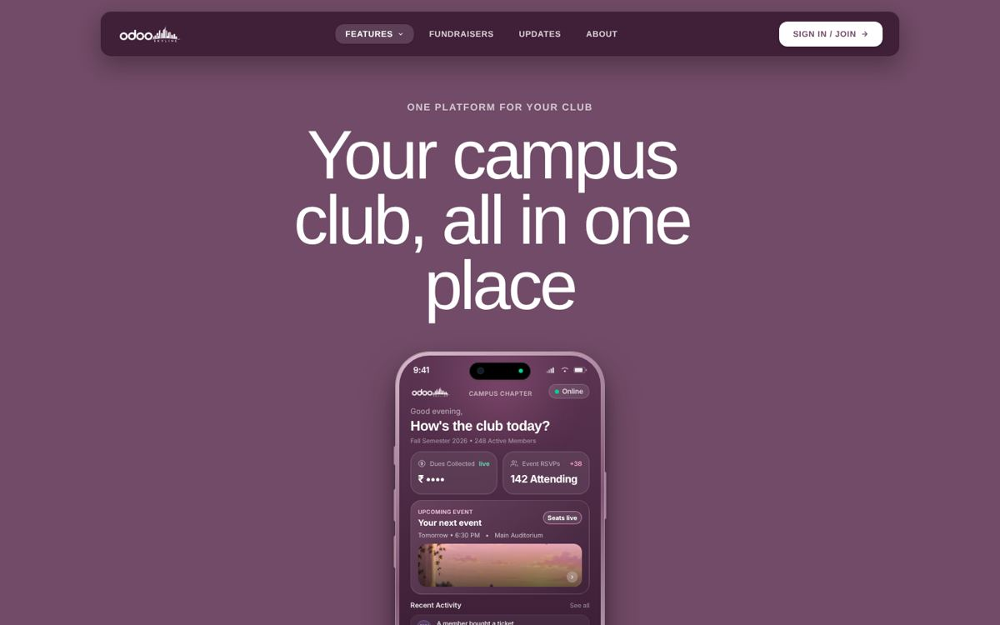 | 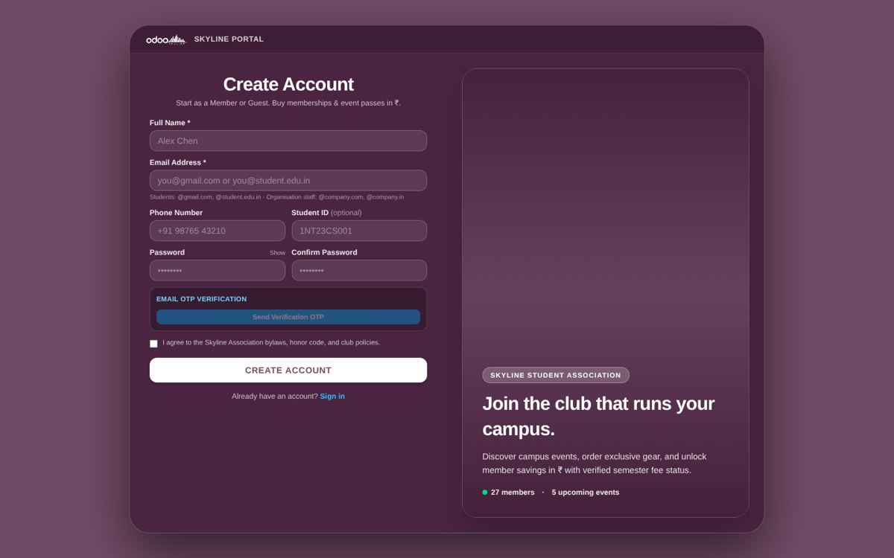 |
| Landing page | Create account: domain rules, e-mail code |
| 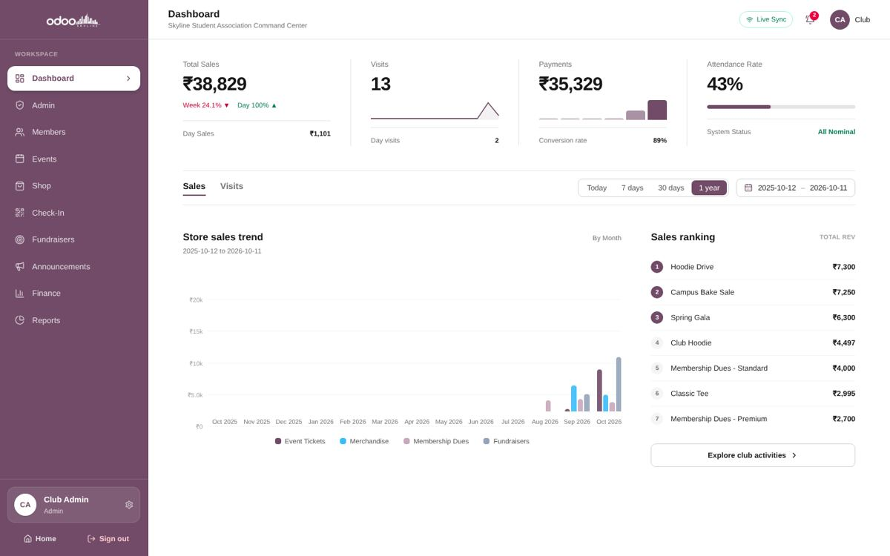 | 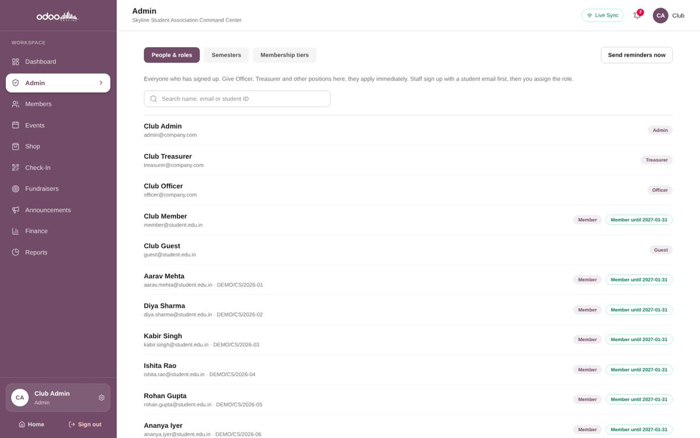 |
| Admin dashboard: sales, visits, payments, attendance, ranking | Admin: users and role assignment |
| 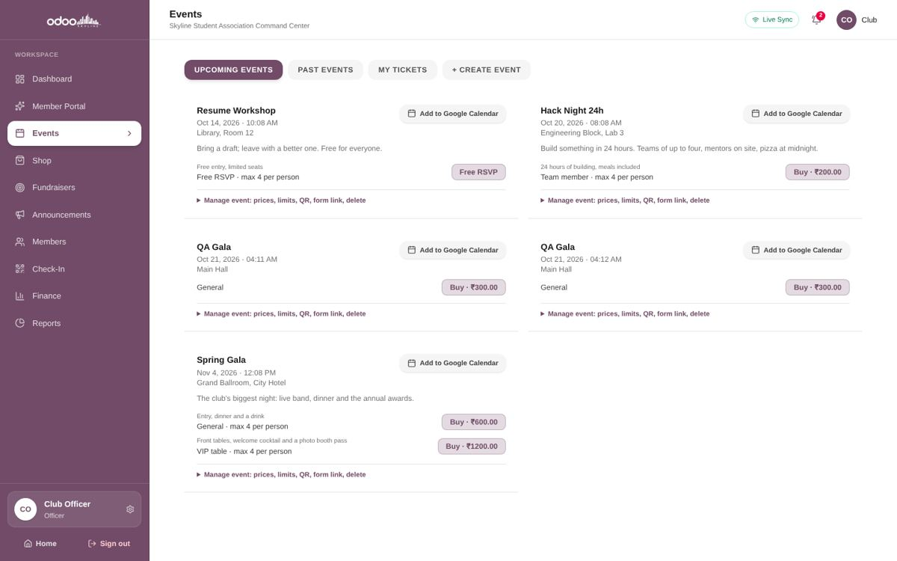 | 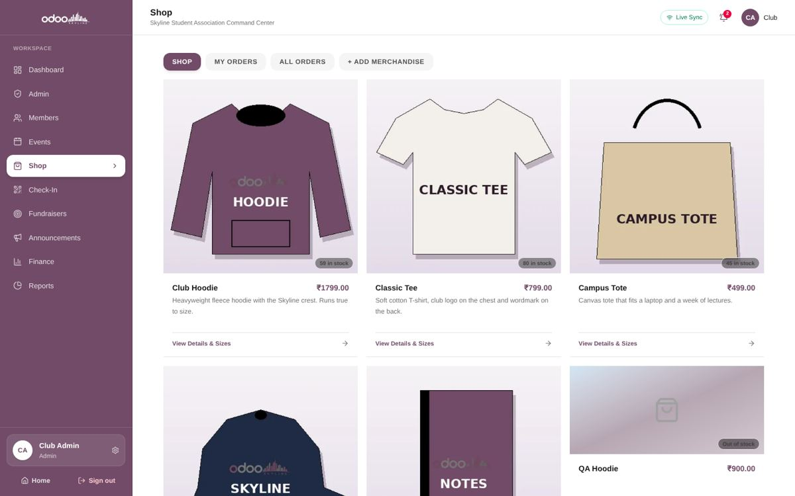 |
| Events: ticket types, prices, limits, Google Calendar, manage event | Shop: products with thumbnails and stock |
| 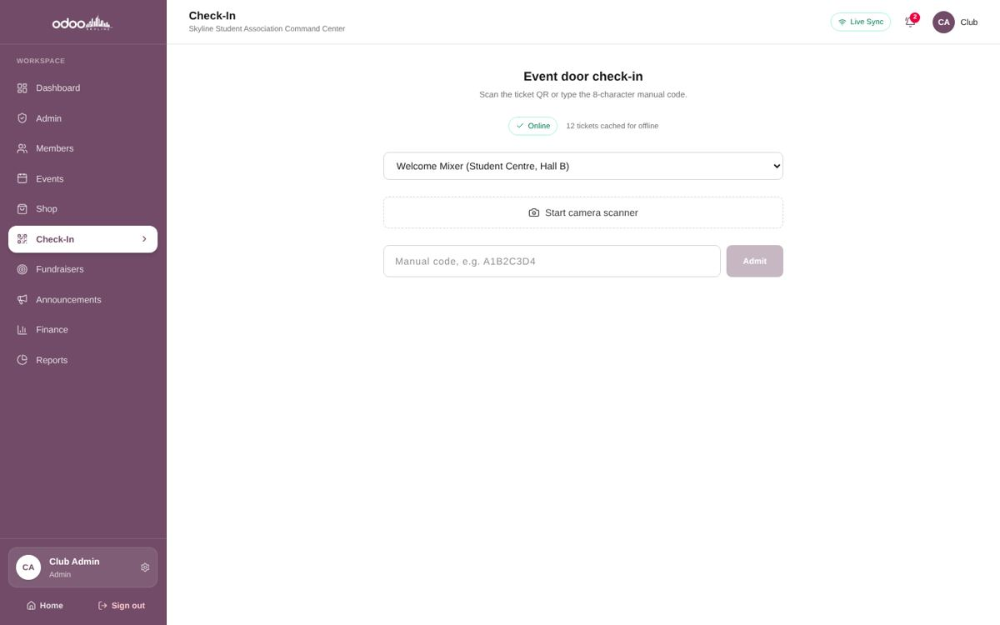 | 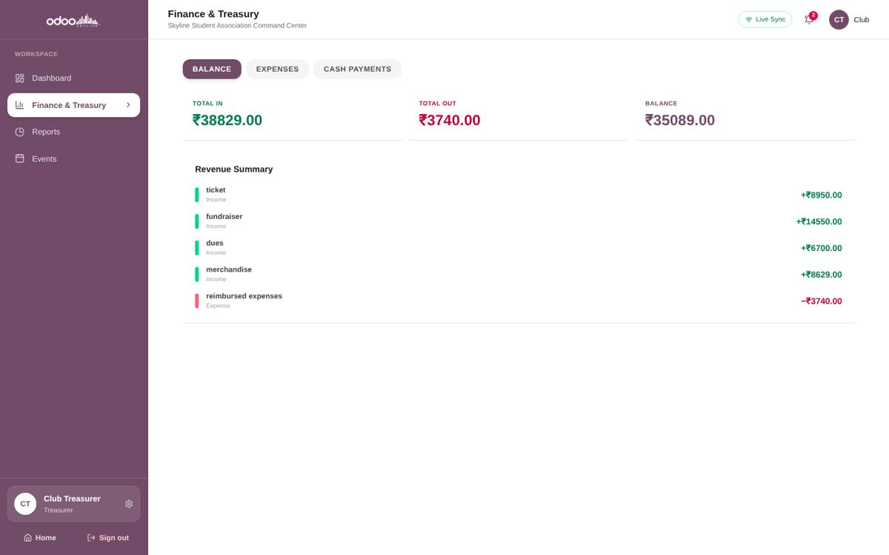 |
| Door check-in: camera scanner, manual code, offline cache | Finance and treasury: in, out, balance |
| 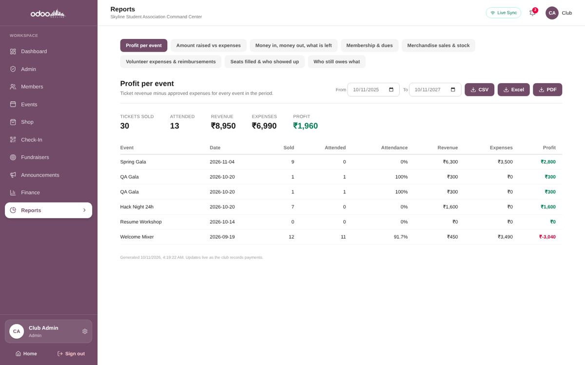 | 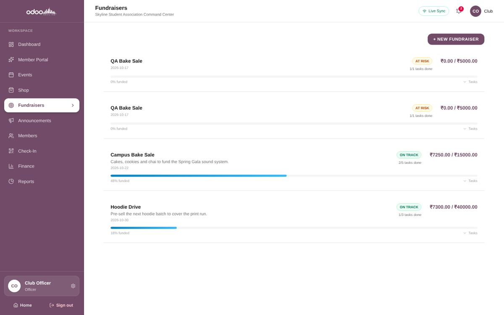 |
| Reports: 8 reports, date range, CSV/Excel/PDF | Fundraisers: tasks, progress, health badge |
| 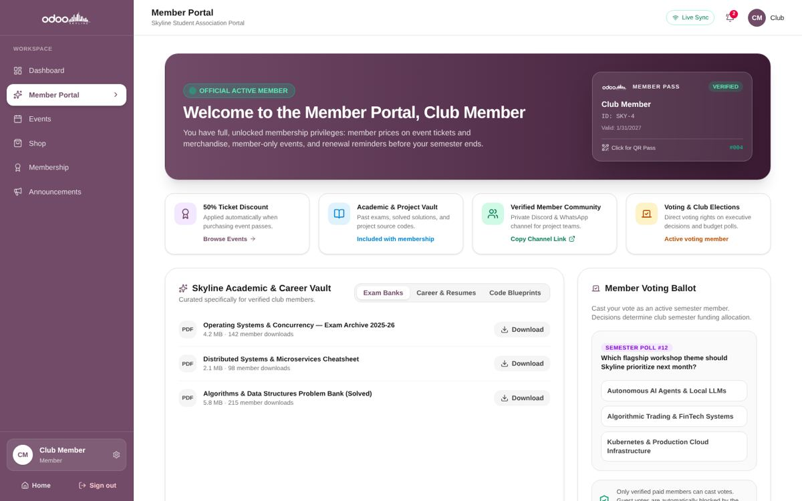 | 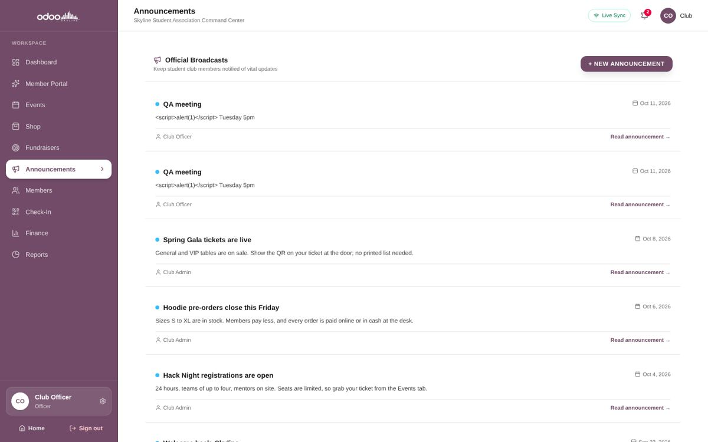 |
| Member portal | Announcements: post once, notify and e-mail |

### On a phone (390 px)

| | | | |
| :---: | :---: | :---: | :---: |
| 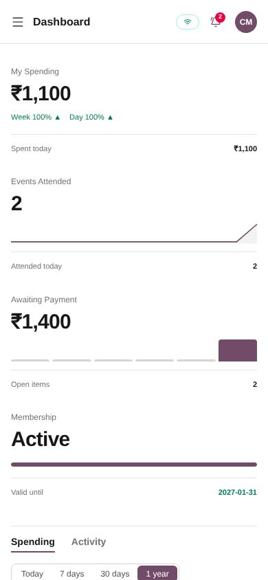 | 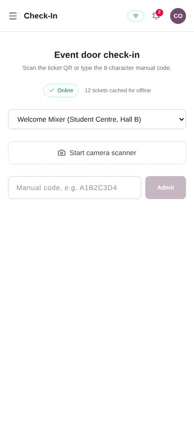 | 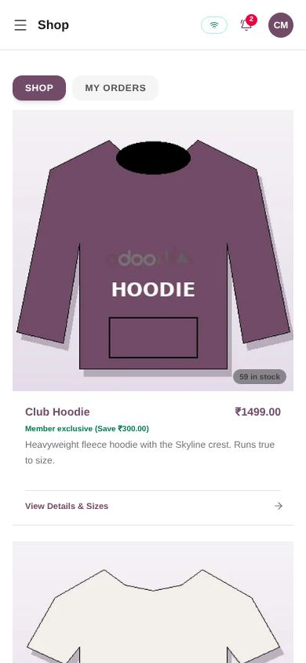 | 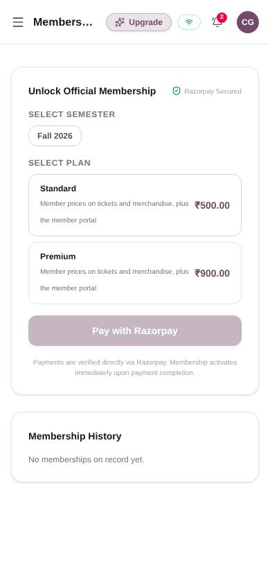 |
| Member dashboard | Check-in at the door | Shop | Buy a membership |

---

## Part 3. Design diagrams

Drawn from the code in the repository, not from the plan. Each one answers a question a jury asks often.

### System architecture

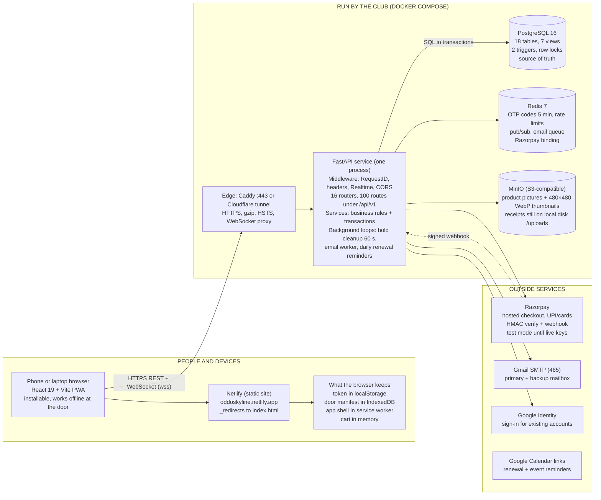
```mermaid
flowchart LR
  subgraph PEOPLE["PEOPLE AND DEVICES"]
    B["Phone or laptop browser<br/>React 19 + Vite PWA<br/>installable, works offline at the door"]
    N["Netlify (static site)<br/>oddoskyline.netlify.app<br/>_redirects to index.html"]
    K["What the browser keeps<br/>token in localStorage<br/>door manifest in IndexedDB<br/>app shell in service worker<br/>cart in memory"]
    B --> N
    N --> K
  end
  subgraph CLUB["RUN BY THE CLUB (DOCKER COMPOSE)"]
    E["Edge: Caddy :443 or Cloudflare tunnel<br/>HTTPS, gzip, HSTS, WebSocket proxy"]
    API["FastAPI service (one process)<br/>Middleware: RequestID, headers, Realtime, CORS<br/>16 routers, 100 routes under /api/v1<br/>Services: business rules + transactions<br/>Background loops: hold cleanup 60 s,<br/>email worker, daily renewal reminders"]
    PG[("PostgreSQL 16<br/>18 tables, 7 views<br/>2 triggers, row locks<br/>source of truth")]
    R[("Redis 7<br/>OTP codes 5 min, rate limits<br/>pub/sub, email queue<br/>Razorpay binding")]
    M[("MinIO (S3-compatible)<br/>product pictures + 480×480 WebP thumbnails<br/>receipts still on local disk /uploads")]
    E --> API
    API -- "SQL in transactions" --> PG
    API --> R
    API --> M
  end
  subgraph OUT["OUTSIDE SERVICES"]
    RZ["Razorpay<br/>hosted checkout, UPI/cards<br/>HMAC verify + webhook<br/>test mode until live keys"]
    SM["Gmail SMTP (465)<br/>primary + backup mailbox"]
    GI["Google Identity<br/>sign-in for existing accounts"]
    GC["Google Calendar links<br/>renewal + event reminders"]
  end
  B -- "HTTPS REST + WebSocket (wss)" --> E
  API --> RZ
  API --> SM
  API --> GI
  RZ -. "signed webhook" .-> API
```

One static site, one API process, and the services it uses. Live demo today: the site is on Netlify; the API runs on a club PC published through a Cloudflare quick tunnel (address changes on restart).

### Backend layers

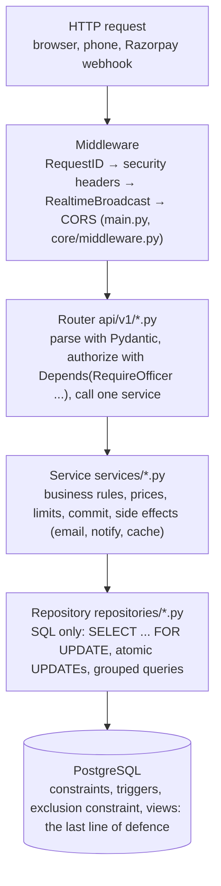
```mermaid
flowchart TB
  H["HTTP request<br/>browser, phone, Razorpay webhook"]
  MW["Middleware<br/>RequestID → security headers → RealtimeBroadcast → CORS (main.py, core/middleware.py)"]
  RT["Router api/v1/*.py<br/>parse with Pydantic, authorize with Depends(RequireOfficer ...), call one service"]
  SV["Service services/*.py<br/>business rules, prices, limits, commit, side effects (email, notify, cache)"]
  RP["Repository repositories/*.py<br/>SQL only: SELECT ... FOR UPDATE, atomic UPDATEs, grouped queries"]
  DB[("PostgreSQL<br/>constraints, triggers, exclusion constraint, views: the last line of defence")]
  H --> MW --> RT --> SV --> RP --> DB
```

How a request moves through the code. Business rules live only in services; the database enforces what must never break.

### Data model: 18 tables in four groups


```mermaid
flowchart TB
  subgraph MM["MEMBERS AND MEMBERSHIPS"]
    members["members<br/>email (unique, lower-case)<br/>password_hash, student_id<br/>phone, joined_on"]
    leadership_roles["leadership_roles<br/>member_id, position, term_year<br/>only source of staff roles"]
    notifications["notifications<br/>member_id, kind, ref<br/>dedupe index: no repeats"]
    semesters["semesters<br/>starts_on, ends_on<br/>EXCLUDE: no overlap"]
    membership_types["membership_types<br/>name, dues_amount<br/>is_offered"]
    memberships["memberships<br/>member, semester, type<br/>dues snapshot, payment_id<br/>UNIQUE(member, semester)"]
  end
  subgraph ET["EVENTS AND TICKETS"]
    events["events<br/>title, venue, starts_at<br/>form_url (after payment)"]
    ticket_types["ticket_types<br/>member / non-member price<br/>seat_limit, non_member_seat_limit<br/>max_per_member, max_per_guest"]
    tickets["tickets<br/>holder, price_paid, payment_id<br/>ticket_code UUID<br/>checked_in_at / by<br/>TRIGGER enforce_seat_limit"]
    announcements["announcements<br/>title, body<br/>posted_by, posted_at"]
    fundraisers["fundraisers<br/>goal_amount, event_date"]
    fundraiser_tasks["fundraiser_tasks<br/>assigned_to, status, due"]
  end
  subgraph ME["MERCHANDISE"]
    products["products<br/>prices, non_member_limit<br/>per-person caps, image_url<br/>is_active (soft hide)"]
    product_variants["product_variants<br/>size, stock_quantity >= 0"]
    orders["orders<br/>member, or name + e-mail<br/>status placed/paid/cancelled<br/>no stored total"]
    order_items["order_items<br/>qty, unit_price snapshot<br/>TRIGGER non-member limit"]
  end
  subgraph MO["MONEY"]
    payments["payments<br/>category dues/ticket/merch/fundraiser<br/>amount > 0, method cash/online<br/>external_ref UNIQUE (Razorpay id)"]
    expenses["expenses<br/>amount, receipt_url<br/>submitted > approved ><br/>reimbursed / rejected"]
  end
  memberships --> payments
  tickets --> payments
  orders --> payments
```

Memberships, tickets and orders point to `payments.payment_id`; a payment pays one membership, one order or many tickets. 7 views: `active_members`, `memberships_due_for_renewal`, `ticket_availability`, `event_summary`, `fundraiser_progress`, … Every staff role is a `leadership_roles` row; every rupee in is a `payments` row.

### Sign-up and sign-in

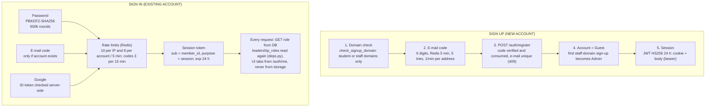
```mermaid
flowchart TB
  subgraph UP["SIGN UP (NEW ACCOUNT)"]
    U1["1. Domain check<br/>check_signup_domain: student or staff domains only"]
    U2["2. E-mail code<br/>6 digits, Redis 5 min, 5 tries, 1/min per address"]
    U3["3. POST /auth/register<br/>code verified and consumed, e-mail unique (409)"]
    U4["4. Account = Guest<br/>first staff-domain sign-up becomes Admin"]
    U5["5. Session<br/>JWT HS256 24 h: cookie + body (bearer)"]
    U1 --> U2 --> U3 --> U4 --> U5
  end
  subgraph IN["SIGN IN (EXISTING ACCOUNT)"]
    P["Password<br/>PBKDF2-SHA256<br/>600k rounds"]
    C["E-mail code<br/>only if account exists"]
    G["Google<br/>ID token checked server-side"]
    RL["Rate limits (Redis)<br/>10 per IP and 8 per account / 5 min; codes 3 per 15 min"]
    ST["Session token<br/>sub = member_id, purpose = session, exp 24 h"]
    EV["Every request: GET role from DB<br/>leadership_roles read again (deps.py),<br/>UI tabs from /auth/me, never from storage"]
    P --> RL
    C --> RL
    G --> RL
    RL --> ST --> EV
  end
```

Three ways in, one session format, role re-read on every request.

### Role levels and what each adds

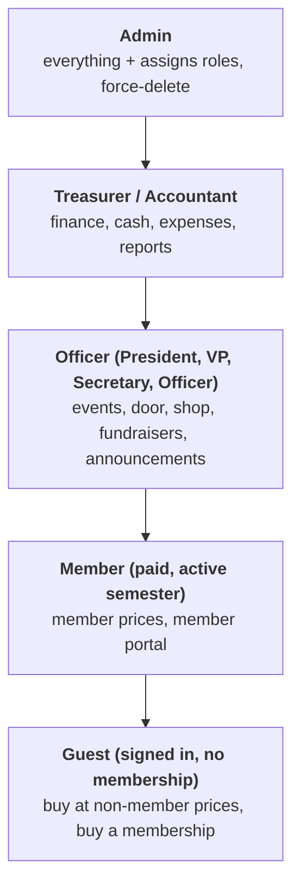
```mermaid
flowchart TB
  A["<b>Admin</b><br/>everything + assigns roles, force-delete"]
  T["<b>Treasurer / Accountant</b><br/>finance, cash, expenses, reports"]
  O["<b>Officer (President, VP, Secretary, Officer)</b><br/>events, door, shop, fundraisers, announcements"]
  M["<b>Member (paid, active semester)</b><br/>member prices, member portal"]
  G["<b>Guest (signed in, no membership)</b><br/>buy at non-member prices, buy a membership"]
  A --> T --> O --> M --> G
```

Each level includes everything inside it. Staff positions are rows in `leadership_roles`; Admin hands them out (`ASSIGNABLE_POSITIONS`). Treasurer is NOT an announcer: `RequireAnnouncer` = Admin + officer titles only.

### Ticket purchase and payment

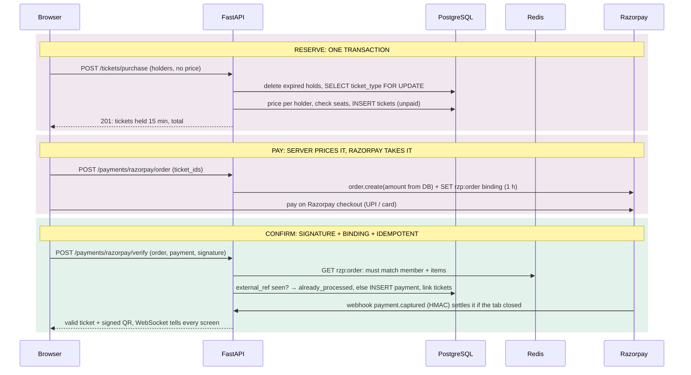
```mermaid
sequenceDiagram
  participant B as Browser
  participant F as FastAPI
  participant P as PostgreSQL
  participant R as Redis
  participant Z as Razorpay
  rect rgb(240, 232, 238)
  Note over B,Z: RESERVE: ONE TRANSACTION
  B->>F: POST /tickets/purchase (holders, no price)
  F->>P: delete expired holds, SELECT ticket_type FOR UPDATE
  F->>P: price per holder, check seats, INSERT tickets (unpaid)
  F-->>B: 201: tickets held 15 min, total
  end
  rect rgb(240, 232, 238)
  Note over B,Z: PAY: SERVER PRICES IT, RAZORPAY TAKES IT
  B->>F: POST /payments/razorpay/order (ticket_ids)
  F->>Z: order.create(amount from DB) + SET rzp:order binding (1 h)
  B->>Z: pay on Razorpay checkout (UPI / card)
  end
  rect rgb(228, 242, 236)
  Note over B,Z: CONFIRM: SIGNATURE + BINDING + IDEMPOTENT
  B->>F: POST /payments/razorpay/verify (order, payment, signature)
  F->>R: GET rzp:order: must match member + items
  F->>P: external_ref seen? → already_processed, else INSERT payment, link tickets
  Z->>F: webhook payment.captured (HMAC) settles it if the tab closed
  F-->>B: valid ticket + signed QR, WebSocket tells every screen
  end
```

Reserve (one locked transaction), pay on Razorpay, confirm with signature + binding + idempotency.

### Ticket lifecycle

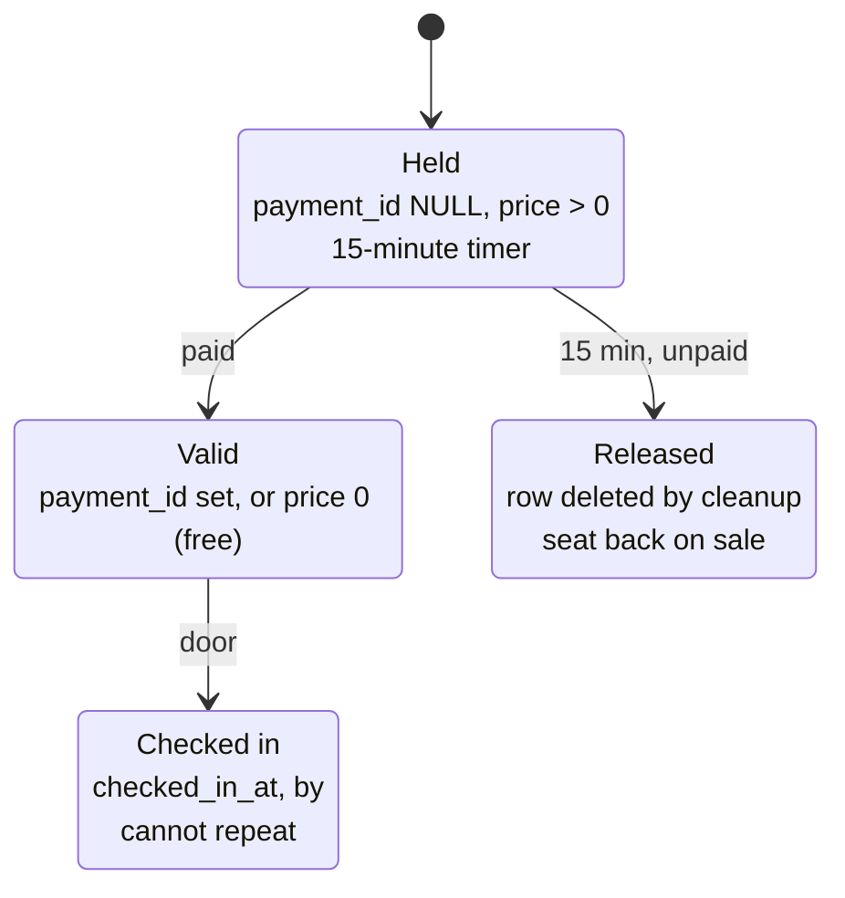
```mermaid
stateDiagram-v2
  Held: Held<br/>payment_id NULL, price > 0<br/>15-minute timer
  Valid: Valid<br/>payment_id set, or price 0 (free)
  CheckedIn: Checked in<br/>checked_in_at, by<br/>cannot repeat
  Released: Released<br/>row deleted by cleanup<br/>seat back on sale
  [*] --> Held
  Held --> Valid: paid
  Valid --> CheckedIn: door
  Held --> Released: 15 min, unpaid
```

A ticket is valid when it has a payment or costs 0; unpaid holds disappear after 15 minutes. Orders: placed → paid, placed → cancelled (member cancel or 15-min expiry; stock restored).

### Door check-in decision

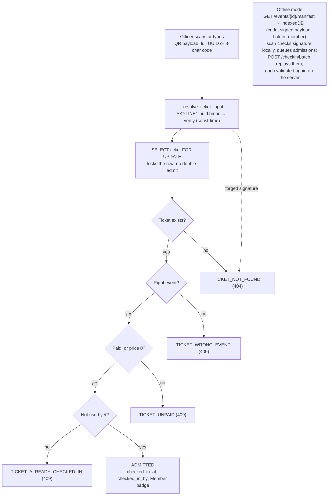
```mermaid
flowchart TB
  S["Officer scans or types<br/>QR payload, full UUID or 8-char code"]
  RS["_resolve_ticket_input<br/>SKYLINE1.uuid.hmac → verify (const-time)"]
  LK["SELECT ticket FOR UPDATE<br/>locks the row: no double admit"]
  Q1{"Ticket exists?"}
  Q2{"Right event?"}
  Q3{"Paid, or price 0?"}
  Q4{"Not used yet?"}
  NF["TICKET_NOT_FOUND (404)"]
  WE["TICKET_WRONG_EVENT (409)"]
  UP["TICKET_UNPAID (409)"]
  AC["TICKET_ALREADY_CHECKED_IN (409)"]
  AD["ADMITTED<br/>checked_in_at, checked_in_by; Member badge"]
  S --> RS --> LK --> Q1
  RS -. "forged signature" .-> NF
  Q1 -- no --> NF
  Q1 -- yes --> Q2
  Q2 -- no --> WE
  Q2 -- yes --> Q3
  Q3 -- no --> UP
  Q3 -- yes --> Q4
  Q4 -- no --> AC
  Q4 -- yes --> AD
  OFF["Offline mode<br/>GET /events/{id}/manifest → IndexedDB<br/>(code, signed payload, holder, member)<br/>scan checks signature locally, queues admissions;<br/>POST /checkin/batch replays them,<br/>each validated again on the server"]
```

Every failure has its own code and screen colour; the row lock makes double entry impossible.

### Real-time updates

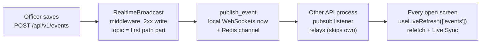
```mermaid
flowchart LR
  A["Officer saves<br/>POST /api/v1/events"] --> B["RealtimeBroadcast<br/>middleware: 2xx write<br/>topic = first path part"]
  B --> C["publish_event<br/>local WebSockets now<br/>+ Redis channel"]
  C --> D["Other API process<br/>pubsub listener<br/>relays (skips own)"]
  D --> E["Every open screen<br/>useLiveRefresh(['events'])<br/>refetch + Live Sync"]
```

The message carries only a topic name, never data: the screen re-reads through the normal, permission-checked API. If Redis is down, local clients are still told (in-memory fallback). `/ws/updates` refuses origins not in `CORS_ORIGINS`.

### Deployment, today and target

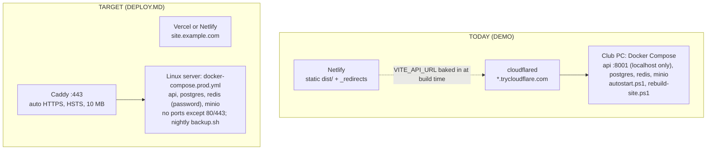
```mermaid
flowchart TB
  subgraph TODAY["TODAY (DEMO)"]
    NL["Netlify<br/>static dist/ + _redirects"]
    CF["cloudflared<br/>*.trycloudflare.com"]
    PC["Club PC: Docker Compose<br/>api :8001 (localhost only), postgres, redis, minio<br/>autostart.ps1, rebuild-site.ps1"]
    CF --> PC
    NL -. "VITE_API_URL baked in at build time" .-> CF
  end
  subgraph TARGET["TARGET (DEPLOY.MD)"]
    VN["Vercel or Netlify<br/>site.example.com"]
    CD["Caddy :443<br/>auto HTTPS, HSTS, 10 MB"]
    LS["Linux server: docker-compose.prod.yml<br/>api, postgres, redis (password), minio<br/>no ports except 80/443; nightly backup.sh"]
    CD --> LS
  end
```

---

## Part 4. Jury questions and answers

113 questions in 13 topics, each tagged 🟢 **Basic**, 🟠 **Intermediate** or 🟣 **Advanced**. Answer the first sentence, then add detail only if asked. File names point to where the logic lives. Click a question to open its answer.

### 1. The problem and the product

<details>
<summary>🟢 <b>Q1. What problem does Skyline solve, in one sentence?</b></summary>

A student club runs members, events and money on a spreadsheet, cash at the door, a notebook budget and WhatsApp. Skyline puts all three jobs in one web app: sign-up and semester dues, online tickets with an instant door check, merchandise with real stock, announcements, fundraisers and a treasurer view that always adds up.
</details>

<details>
<summary>🟢 <b>Q2. Who are the users?</b></summary>

Five levels: **Guest** (signed in, no paid membership), **Member** (paid for the current semester), **Officer** (President, Vice President, Secretary, Officer), **Treasurer/Accountant**, and **Admin**. Visitors who are not signed in can browse the landing page, events and the shop. Each level sees its own sidebar tabs (`getTabsForRole` in `RoleDashboard.tsx`).
</details>

<details>
<summary>🟢 <b>Q3. Map the six scenes of the brief to features.</b></summary>

| Scene | Feature |
| :--- | :--- |
| A new student joins | Sign-up with e-mailed code, Membership tab (semester + type), renewal reminders, member badge at the door |
| Spring Gala tickets | Events tab, member/non-member prices, seat and non-member caps, signed QR, Check-In tab, event-profit report |
| Announcing a meeting | Announcements tab: post once, in-app notification + e-mail to every member, dated history |
| Hoodies | Shop: sizes with stock, cart, 15-minute hold, Razorpay, merch design studio |
| Fundraiser | Tasks with assignee and status, progress vs goal, On track / At risk badge |
| Treasurer | Finance: money in by category, reimbursed expenses, balance, cash payments; 8 reports in CSV/Excel/PDF |
</details>

<details>
<summary>🟢 <b>Q4. What did you add beyond the brief, and why?</b></summary>

Real role-based sign-in, Razorpay online payment, semester-wise memberships with types, non-member seat and goodie limits, per-person purchase caps, eight exportable reports, real-time updates over WebSocket, an installable PWA with offline door check-in, Google Calendar reminders, a merchandise design studio and MinIO picture storage. Each came from a requirement round (report section 3).
</details>

<details>
<summary>🟢 <b>Q5. Why should a club use this instead of Google Forms and a sheet?</b></summary>

Forms cannot stop the 101st ticket being sold, cannot verify a ticket at the door in a second, cannot take UPI payment and match it to the right order, and cannot give the treasurer a balance that is correct by construction. Here every rupee is a row in one `payments` table, every seat is a row counted under a lock, and every role is checked on the server.
</details>

<details>
<summary>🟠 <b>Q6. What is the single most important design decision?</b></summary>

PostgreSQL is the source of truth for anything that must not be wrong (seats, stock, money, roles), and the rules that protect it live in the database itself (row locks, triggers, constraints). Redis, the browser and the cache can all be wrong or empty and nothing is lost.
</details>

### 2. Architecture and stack

<details>
<summary>🟢 <b>Q7. Describe the architecture.</b></summary>

A React 19 + Vite single-page app (installable PWA) talks HTTPS/JSON and a WebSocket to one FastAPI service. FastAPI uses PostgreSQL 16 for data, Redis 7 for short-lived state, MinIO for pictures, Razorpay for payments and Gmail SMTP for e-mail. See the architecture diagram in Part 3.
</details>

<details>
<summary>🟢 <b>Q8. Why FastAPI?</b></summary>

The workload is many short concurrent requests (a ticket rush); FastAPI with async SQLAlchemy + asyncpg handles that on one process, gives typed request/response models with Pydantic v2, automatic validation (422) and OpenAPI docs in development.
</details>

<details>
<summary>🟢 <b>Q9. Why PostgreSQL and not MongoDB or MySQL?</b></summary>

We need row locks (`SELECT ... FOR UPDATE`), triggers, an exclusion constraint on date ranges (`EXCLUDE USING gist`) and views. Money and seat rules belong in a relational database with real transactions. MySQL has no exclusion constraints; MongoDB would push all of these guarantees into application code.
</details>

<details>
<summary>🟢 <b>Q10. Why React + Vite + Tailwind?</b></summary>

Fast builds and hot reload, one component per dashboard tab (`panels/*.tsx`), and a small utility-class design system. The build is static, so it can be hosted free on Netlify or Vercel.
</details>

<details>
<summary>🟠 <b>Q11. What does Redis do, exactly?</b></summary>

Only short-lived things: 6-digit sign-in codes (5 minutes), rate-limit counters, the e-mail queue, pub/sub for real-time updates between processes, the Razorpay order binding (1 hour) and 30-60 second report caches. Keys use the prefix `oddo:v1:`. Nothing in Redis is the only copy of a club record.
</details>

<details>
<summary>🟠 <b>Q12. What happens if Redis goes down?</b></summary>

Rate limits fail open (logged), report caches miss and read PostgreSQL, real-time messages still reach clients on the same process (in-memory fallback in `core/realtime.py`). Things that need Redis to be safe refuse instead: sign-in codes cannot be issued, and Razorpay order creation returns 503 so a payment is never taken without its binding.
</details>

<details>
<summary>🟠 <b>Q13. Why MinIO?</b></summary>

S3-compatible object storage for product pictures and design exports, with 480×480 WebP thumbnails. The same code works with AWS S3 later by changing the endpoint and keys. Files never go into PostgreSQL.
</details>

<details>
<summary>🟠 <b>Q14. Why one API process and not several workers?</b></summary>

The hold cleanup, e-mail worker and reminder loops run inside the app process (`lifespan` in `main.py`). Several workers would run them several times. To scale out, move the loops into a separate worker container first; the WebSocket fan-out already supports many processes through Redis pub/sub.
</details>

<details>
<summary>🟠 <b>Q15. How is the backend layered?</b></summary>

Router (parse + authorize) → Service (business rules, transaction, commit) → Repository (SQL only) → PostgreSQL (constraints and triggers). Routers never contain business logic; repositories never know about HTTP. Diagram in Part 3.
</details>

<details>
<summary>🟣 <b>Q16. Why a static frontend and a separate API instead of server-side rendering?</b></summary>

Netlify/Vercel cannot run long-lived WebSockets, background loops, PostgreSQL or Redis. Splitting gives free static hosting and a single API server we control. Trade-off: the API address is baked into the build (`VITE_API_URL`), so changing the API host means rebuilding the site.
</details>

### 3. Database

<details>
<summary>🟢 <b>Q17. How many tables and views?</b></summary>

18 tables and 7 views in the running database (`database/schema.sql`; the header comment still says 17 because `notifications` was added later). Two triggers: `tickets_seat_limit` and `order_items_non_member_limit`.
</details>

<details>
<summary>🟢 <b>Q18. Name the main tables.</b></summary>

members, leadership_roles, semesters, membership_types, memberships, payments, events, ticket_types, tickets, announcements, products, product_variants, orders, order_items, fundraisers, fundraiser_tasks, expenses, notifications.
</details>

<details>
<summary>🟢 <b>Q19. Name the views and what each answers.</b></summary>

`active_members` (paid and today inside the semester), `memberships_due_for_renewal`, `ticket_availability` (seats left, total and non-member), `event_summary` (sold, attended, revenue), `fundraiser_progress`, `treasurer_summary` (in by category, out), `club_balance` (in minus out).
</details>

<details>
<summary>🟢 <b>Q20. How is money stored?</b></summary>

`NUMERIC(10,2)` in PostgreSQL, `Decimal` in Python, strings like `"500.00"` in JSON, paise integers only when talking to Razorpay. Never floats, because 0.1 + 0.2 is not exactly 0.3.
</details>

<details>
<summary>🟢 <b>Q21. Where do roles live?</b></summary>

Only in `leadership_roles (member_id, position, term_year)`, unique together. There is no role column on members, so elections are new rows and last year's officers lose access automatically.
</details>

<details>
<summary>🟠 <b>Q22. What makes someone a member?</b></summary>

A row in `memberships` for the semester that contains today, with `payment_id` set. No payment id means no benefits, so a cancelled or failed payment can never grant member prices. One membership per member per semester (`UNIQUE(member_id, semester_id)`).
</details>

<details>
<summary>🟠 <b>Q23. How do you stop two semesters overlapping?</b></summary>

An exclusion constraint: `EXCLUDE USING gist (daterange(starts_on, ends_on, '[]') WITH &&)`. The database refuses any semester whose date range overlaps another, so "which semester is today?" always has one answer. It needs the `btree_gist` extension.
</details>

<details>
<summary>🟠 <b>Q24. Why copy the price into memberships, tickets and order_items?</b></summary>

Snapshots. `dues_amount`, `price_paid` and `unit_price` freeze what was charged, so editing a price tomorrow never rewrites history or the treasurer's totals.
</details>

<details>
<summary>🟠 <b>Q25. Why is there no total column on orders?</b></summary>

A stored total can disagree with its lines. The total is always `SUM(quantity * unit_price)` of the order's lines (`_order_total`). An early bug read a non-existent `Order.total_amount` and returned 500; the fix was to compute it.
</details>

<details>
<summary>🟠 <b>Q26. Why does payments.external_ref have a UNIQUE constraint?</b></summary>

It stores the Razorpay payment id. A duplicate verify call or a webhook retry tries to insert the same id and is detected first, so one real payment is recorded exactly once (idempotency).
</details>

<details>
<summary>🟠 <b>Q27. Explain the CHECK on expenses.</b></summary>

`CHECK ((status = 'reimbursed') = (reimbursed_at IS NOT NULL))`: the reimbursed date exists exactly when the status is reimbursed. It is impossible to mark one without the other.
</details>

<details>
<summary>🟣 <b>Q28. Walk through the seat-limit trigger.</b></summary>

`enforce_seat_limit` runs **before insert** on tickets. It reads the ticket type's `seat_limit` and `non_member_seat_limit` with `FOR UPDATE` (locking that row), counts all tickets and those with `member_id IS NULL`, and raises *Sold out* or *Sold out for non-members*. The service does the same check first for a friendly error; the trigger is the backstop that holds even if application code is wrong.
</details>

<details>
<summary>🟣 <b>Q29. Walk through the non-member goodie trigger.</b></summary>

On each new `order_items` row: if the order belongs to a member, allow. Otherwise lock the **product** row (the limit is shared across sizes), sum quantities on non-member orders that are `placed` or `paid`, and refuse if this line would exceed `non_member_limit`. Cancelled orders do not count, so units return automatically. Whoever locks first is served first.
</details>

<details>
<summary>🟣 <b>Q30. Why are these rules in the database and not just in Python?</b></summary>

Two phones buying the last seat in the same millisecond must produce exactly one ticket. Application checks alone race (both read 99 sold, both insert). A row lock serialises buyers of the same ticket type, and a trigger under that lock cannot be bypassed by any code path, script or future endpoint.
</details>

<details>
<summary>🟣 <b>Q31. Which indexes did you add and why?</b></summary>

On the hot paths: `tickets(ticket_code)` unique (door lookup), tickets by member/e-mail/payment, payments by date and member, orders by status and member, events and announcements by date, active products, memberships by member and semester, and the notifications de-duplication index `(member_id, kind, ref)`.
</details>

<details>
<summary>🟣 <b>Q32. How do schema changes reach an existing database?</b></summary>

`scripts/bootstrap.py` creates the full schema on an empty database and then applies later additions idempotently (`ADD COLUMN IF NOT EXISTS`, `CREATE INDEX IF NOT EXISTS`). Old databases upgrade in place and the previous release still runs, so a rollback is safe. Alembic is set up with a baseline for future migrations.
</details>

<details>
<summary>🟣 <b>Q33. What does the event_summary view get wrong?</b></summary>

It counts every ticket row, including unpaid 15-minute holds, so during a rush sold and revenue are briefly inflated. The event-profit report in `report_center.py` is the authoritative number; fixing the view means joining only valid tickets (`payment_id IS NOT NULL OR price_paid = 0`).
</details>

### 4. Backend and API

<details>
<summary>🟢 <b>Q34. How many endpoints are there?</b></summary>

100 routes under `/api/v1` in 16 routers (plus root health routes and the `/ws/updates` WebSocket). Groups: auth, members and memberships, events and tickets, products and orders, payments, webhooks, fundraisers, announcements, expenses and treasurer, dashboard, reports, admin, notifications, system. Full list in the appendix.
</details>

<details>
<summary>🟢 <b>Q35. What does an error look like?</b></summary>

Always `{"error": {"code", "message", "details", "request_id"}}` (`core/handlers.py`). The UI decides what to show from the code (e.g. `SOLD_OUT_NON_MEMBER`, `TICKET_ALREADY_CHECKED_IN`); unhandled errors show "Reference: &lt;id&gt;" and are logged with the same id. Verified in testing.
</details>

<details>
<summary>🟢 <b>Q36. What is X-Request-ID for?</b></summary>

`RequestIDMiddleware` stamps every response and log line with an id. A user can quote it, and we find the exact request in the logs.
</details>

<details>
<summary>🟠 <b>Q37. How does the API validate input?</b></summary>

Pydantic models on every body (lengths, e-mail format, positive integers, regex for categories). Money fields are strings parsed by `to_decimal`; non-numbers and negatives return 422. SQL uses SQLAlchemy or `text()` with bound parameters only. A search for `' OR 1=1 --` returned 0 results in testing.
</details>

<details>
<summary>🟠 <b>Q38. How does buying a ticket work, step by step?</b></summary>

`event_service.purchase_tickets`: look up each holder's e-mail and whether they are an active member; check per-person caps; `event_repo.reserve_tickets` deletes expired holds, locks the ticket type, counts, prices each holder, inserts unpaid tickets (trigger checks again); commit; invalidate report caches; return the tickets and the total. Payment follows. Sequence diagram in Part 3.
</details>

<details>
<summary>🟠 <b>Q39. How long is a hold, and who releases it?</b></summary>

15 minutes. Each purchase first deletes expired holds for its ticket type (lazy cleanup), and `jobs/hold_cleanup.release_unpaid_holds` runs every 60 seconds to delete unpaid tickets older than 15 minutes and cancel unpaid orders (restoring stock). It never touches a paid ticket (`payment_id IS NULL AND price_paid > 0`).
</details>

<details>
<summary>🟠 <b>Q40. How does a shop order stay correct under load?</b></summary>

`shop_repo.place_order` is one transaction: lock the affected variants (`FOR UPDATE OF product_variants`), for non-members lock the product and check the quota, create the order, check and decrement stock per line, insert lines. `CHECK (stock_quantity >= 0)` is the backstop. Cancelling restores stock in the same transaction.
</details>

<details>
<summary>🟠 <b>Q41. Who decides the price, the browser or the server?</b></summary>

The server. The purchase and order requests carry no price. The member price comes from the database; Razorpay orders are created for the amount computed from the database, and verify refuses a mismatch. (One weakness found in testing: for tickets the member price is chosen from the *typed holder e-mail*; see finding F2.)
</details>

<details>
<summary>🟠 <b>Q42. How are reports produced?</b></summary>

`api/v1/report_center.py` has a registry of 8 reports (event-profit, fundraisers, money, membership, merchandise, expenses, attendance, outstanding) sharing one shape (columns with kinds, rows, totals). `GET /reports/{key}?format=json|csv|xlsx|pdf`; Excel via XlsxWriter, PDF via ReportLab with logo and watermark. All 8 × 4 = 32 exports returned 200 in testing.
</details>

<details>
<summary>🟠 <b>Q43. How do e-mails work?</b></summary>

Jobs (otp, renewal_reminder, event_reminder, announcement_broadcast, ...) are pushed to a Redis list and sent by `run_email_worker`: primary Gmail then backup, implicit TLS on 465 (587 was blocked), multipart text + branded HTML with the logo embedded, three attempts with back-off. Tests blank the SMTP settings so they never send real mail.
</details>

<details>
<summary>🟠 <b>Q44. How do renewal reminders work?</b></summary>

A daily job finds paid memberships whose semester ends within 30 days and that were not renewed; it notifies at 30 days and again at 7 days, queues an e-mail with an "Add to Google Calendar" link and stamps `renewal_reminder_sent_at`. Notifications are de-duplicated by a unique index. Members can also download an .ics file.
</details>

<details>
<summary>🟣 <b>Q45. How does real-time updating work?</b></summary>

`RealtimeBroadcastMiddleware` sees every successful write under `/api/v1`, derives a topic from the path (events, shop, finance, ...) and publishes `data_changed`. `publish_event` sends to local WebSocket clients and to a Redis channel; other processes relay it. In the browser `useLiveRefresh(['shop'], reload)` refetches. The message carries only the topic, never data, so permissions are re-checked by the normal API.
</details>

<details>
<summary>🟣 <b>Q46. Is the WebSocket authenticated?</b></summary>

No, and it does not need to be for confidentiality: it only broadcasts topic names. It checks the `Origin` header against `CORS_ORIGINS` and closes with 1008 otherwise, so other websites cannot open it from a victim's browser. Data is fetched over authenticated REST.
</details>

<details>
<summary>🟣 <b>Q47. What does the dashboard compute?</b></summary>

`GET /dashboard/summary` returns cards, a time-bucketed series and a ranking. Staff see club-wide numbers; members and guests get `scope: personal` (verified in testing), which the UI relabels (e.g. "Where my money went"). Timestamps are UTC-aware; an early bug showed ₹0 because naive datetimes were read in server local time.
</details>

<details>
<summary>🟣 <b>Q48. What runs at startup?</b></summary>

The lifespan refuses to start outside development if `JWT_SECRET` is default or short, then starts four tasks: hold cleanup (60 s), e-mail worker, daily renewal reminders and the Redis pub/sub listener. (Code review found the reminder loop is defined and started twice; finding F10.)
</details>

### 5. Authentication and authorization

<details>
<summary>🟢 <b>Q49. How do people sign up?</b></summary>

Name, e-mail, password and a 6-digit code e-mailed to them. `check_signup_domain` allows only configured student domains (gmail.com, student.edu.in) and staff domains (company.com, company.in). Everyone starts as Guest; the first staff-domain account becomes Admin. Testing: sign-up without a code 422, wrong code 401, bad domain 422, duplicate 409, correct code 201 Guest.
</details>

<details>
<summary>🟢 <b>Q50. How do people sign in?</b></summary>

Password, or a code e-mailed to an existing account, or Google for an existing account. All three return a 24-hour session.
</details>

<details>
<summary>🟢 <b>Q51. How are passwords stored?</b></summary>

PBKDF2-HMAC-SHA256 with 600,000 iterations and a random 16-byte salt per password, in the format `pbkdf2_sha256$iterations$salt$hash`. Comparison is constant-time (`hmac.compare_digest`). The iteration count is in the hash, so we can raise it without breaking old passwords.
</details>

<details>
<summary>🟠 <b>Q52. What is in the session token?</b></summary>

An HS256 JWT with only `sub` (member id), `purpose: session`, `iat` and `exp` (24 h). No role is inside it: the role is read from `leadership_roles` on every request, so removing an officer takes effect on their next click.
</details>

<details>
<summary>🟠 <b>Q53. Cookie or bearer token?</b></summary>

Both. Sign-in sets an `HttpOnly; SameSite=Lax` cookie (Secure outside development) and returns the token in the body; the SPA sends it as a bearer header because the site (Netlify) and API (another domain) are cross-site. Trade-off: the token is also kept in `localStorage` (`skyline_token`), which an XSS bug could read (finding F9).
</details>

<details>
<summary>🟠 <b>Q54. How are roles enforced?</b></summary>

Declaratively with FastAPI dependencies in `api/deps.py`: `RequireOfficer`, `RequireAdmin`, `RequireAnnouncer` (Admin + officer titles, not finance), `RequireTreasurer` (Treasurer, Accountant, Admin). Example: `_: Annotated[MemberInfo, Depends(RequireAnnouncer)]`. The UI hides tabs too, but that is convenience; testing called hidden endpoints directly and got 403.
</details>

<details>
<summary>🟠 <b>Q55. Can a member make themselves Admin?</b></summary>

No. `POST /leadership` is Admin-only and accepts only `ASSIGNABLE_POSITIONS`. Tested: member and officer both got 403. Editing localStorage changes nothing because the UI re-reads the role from `/auth/me`.
</details>

<details>
<summary>🟠 <b>Q56. How do the sign-in codes resist guessing?</b></summary>

6 digits from `secrets`, stored in Redis for 5 minutes, deleted after 5 wrong attempts or on first success. Issuing is limited to 1 per address per minute, 3 per address per 15 minutes and 5 per IP per 5 minutes (tested: 200 then 429). Codes are only sent to addresses that can use them.
</details>

<details>
<summary>🟣 <b>Q57. Why not keep the magic-link flow?</b></summary>

The routes `/auth/magic-link` and `/auth/token` still exist from the first design but the UI uses codes and passwords. Codes work on a phone without switching apps and are easier to rate-limit per address. Unused legacy routes should be removed to shrink the attack surface.
</details>

<details>
<summary>🟣 <b>Q58. What is the threat model for sessions?</b></summary>

Stolen token: valid until expiry (24 h); emergency revoke is rotating `JWT_SECRET` (signs everyone out). There is no server-side session list, no MFA for Admin and no audit log of role changes; these are listed as known limits.
</details>

### 6. Tickets, QR and the door

<details>
<summary>🟢 <b>Q59. What is inside the ticket QR?</b></summary>

Not a URL. `SKYLINE1.<ticket-uuid>.<signature>`, where the signature is the first 20 hex characters of `HMAC-SHA256(TICKET_SIGNING_SECRET, uuid)`. A phone camera just shows opaque text; only the club's check-in can verify it, and a forged code fails (tested: 404).
</details>

<details>
<summary>🟢 <b>Q60. How fast is the door check?</b></summary>

One indexed lookup on the unique `ticket_code` plus a row lock and update. The screen shows Admitted (with Member badge), Already used, Unpaid, Wrong event or Not found.
</details>

<details>
<summary>🟠 <b>Q61. Why a separate TICKET_SIGNING_SECRET?</b></summary>

So leaking or rotating the login key does not let anyone forge tickets, and vice versa. `_ticket_key()` refuses to sign if it is unset. Rotating it invalidates every issued QR, so do it between events.
</details>

<details>
<summary>🟠 <b>Q62. Can the same ticket get in twice?</b></summary>

No. `check_in_ticket` locks the ticket row `FOR UPDATE`, so two phones scanning together are serialised and the second sees `checked_in_at` already set. Tested: second scan via the 8-character code returned 409 TICKET_ALREADY_CHECKED_IN.
</details>

<details>
<summary>🟠 <b>Q63. What is the 8-character manual code?</b></summary>

A short form of the ticket UUID printed under the QR for when the camera fails. The server resolves it within the event; the full UUID and the signed payload are also accepted.
</details>

<details>
<summary>🟣 <b>Q64. How does offline check-in work?</b></summary>

While online the Check-In panel downloads `GET /events/{id}/manifest` (codes, signed payloads, holders, member flag) into IndexedDB. Offline scans are verified against the server-issued signed payloads, queued, and replayed through `POST /checkin/batch`; the server validates each scan independently and returns per-scan results (tested: one ALREADY_CHECKED_IN, one NOT_FOUND). Conflicts are listed, never silently merged.
</details>

<details>
<summary>🟣 <b>Q65. What are the risks of offline mode?</b></summary>

A ticket refunded or reassigned after the manifest was downloaded is still accepted offline until sync; two offline phones could each admit the same person, and the batch would report the second as a conflict. Mitigation: refresh the manifest just before doors open and keep one device per entrance.
</details>

<details>
<summary>🟣 <b>Q66. How is attendance reported?</b></summary>

`checked_in_at` on each ticket. The attendance and event-profit reports count sold vs attended vs no-shows and compute profit = ticket revenue minus approved and reimbursed expenses linked to the event.
</details>

### 7. Payments (Razorpay)

<details>
<summary>🟢 <b>Q67. How does online payment work?</b></summary>

Four steps: (1) `POST /payments/razorpay/order` recomputes the amount from the database and creates a Razorpay order, storing a binding `oddo:v1:rzp:<order_id>` (member, category, items, amount) in Redis for an hour; (2) the buyer pays in Razorpay checkout; (3) `POST /payments/razorpay/verify` checks the signature and binding, then records the payment; (4) the signed webhook settles the same payment if the tab was closed.
</details>

<details>
<summary>🟠 <b>Q68. How is the Razorpay signature verified?</b></summary>

`HMAC-SHA256(order_id|payment_id, key_secret)` compared in constant time. Tested: a forged signature returned 400 PAYMENT_SIGNATURE_INVALID, and a webhook with a bad `X-Razorpay-Signature` returned 401.
</details>

<details>
<summary>🟠 <b>Q69. Why the Redis binding?</b></summary>

A valid signature only proves Razorpay saw *some* payment. Without the binding, a signature from a cheap ₹100 order could be replayed against a ₹1,500 order. Verify refuses unless the member, category, membership, ticket ids and order id match what the order was created for.
</details>

<details>
<summary>🟠 <b>Q70. What stops double recording?</b></summary>

`payments.external_ref` is unique and checked first; a repeat verify returns `already_processed` and the webhook returns `already_recorded`.
</details>

<details>
<summary>🟠 <b>Q71. What does the browser show if payment fails?</b></summary>

`frontend/src/razorpayPayment.ts` reports exactly one outcome per checkout: success only after the server confirms; a declined card (`payment.failed`), a closed window or a failed verify calls the error path and never shows success. The membership stays "Payment Pending" with a Pay now button.
</details>

<details>
<summary>🟠 <b>Q72. Can an officer take cash?</b></summary>

Yes. `POST /payments/cash` ("Mark cash received") records a cash payment and links the membership, tickets or order in one transaction. Tested: a held ticket became valid after cash was recorded.
</details>

<details>
<summary>🟣 <b>Q73. What happens if the payment arrives after the hold expired?</b></summary>

Today the webhook `settle()` finds the held tickets deleted (or the order cancelled), treats them as already paid and returns without recording anything, so money can be captured with no ticket and no alert (finding F6). Fix: record the payment, re-check the seat under the lock, re-issue if free, otherwise refund and notify.
</details>

<details>
<summary>🟣 <b>Q74. Is there an unsafe payment path?</b></summary>

Yes, found in testing: the legacy `POST /api/v1/webhooks/payment` accepts any amount with no signature and links it to any membership, ticket or order. A forged ₹1 call marked a ₹700 order paid (finding F1, critical). It predates Razorpay and must be removed before the demo.
</details>

### 8. Frontend and design

<details>
<summary>🟢 <b>Q75. How is the frontend structured?</b></summary>

`main.tsx` mounts the app and registers the service worker; `App.tsx` does hash routing (`#auth`, `#dashboard`, `#event/<id>`) and restores the session from `/auth/me`; `AuthPage.tsx` handles sign-in/up; `RoleDashboard.tsx` draws the sidebar per role and hosts one panel per tab (`panels/*.tsx`).
</details>

<details>
<summary>🟢 <b>Q76. Why hash routing?</b></summary>

Static hosting with no server rewrites needed for deep links, and the poster QR opens `#event/<id>` directly. Netlify also has a `_redirects` rule to `index.html`.
</details>

<details>
<summary>🟢 <b>Q77. What is the design system?</b></summary>

White plain surfaces, hairline dividers, one accent colour (plum #714B67) for primary actions, active tabs and the sidebar; green/amber/rose only for status. Font TT Firs Neue, icons from lucide-react, no emoji. Sidebar becomes a drawer on phones; layouts use responsive grids. Charts are hand-drawn SVG, no chart library.
</details>

<details>
<summary>🟠 <b>Q78. How does the UI talk to the API?</b></summary>

One `fetch` wrapper (`apiClient.ts`): base URL from `VITE_API_URL`, bearer token, `ApiError` with a readable message, and a 401 handler that signs out.
</details>

<details>
<summary>🟠 <b>Q79. Why are popups rendered with createPortal?</b></summary>

They were inside a scrolling, animated container, so `position: fixed` was relative to that container and modals opened off-screen. Portalling into `document.body` anchors them to the viewport.
</details>

<details>
<summary>🟠 <b>Q80. What makes it a PWA?</b></summary>

`manifest.webmanifest`, icons, and `sw.js` caching the app shell (never API calls). Installable from the browser; the door scanner loads without signal. The service worker is served with `Cache-Control: no-cache` so updates arrive.
</details>

<details>
<summary>🟠 <b>Q81. How are money inputs sanitised?</b></summary>

`numeric.ts`: money fields accept digits and one decimal point (2 places), counts accept digits only. The server also rejects non-numbers with 422 (tested).
</details>

<details>
<summary>🟣 <b>Q82. Describe the merchandise design studio.</b></summary>

`components/MerchDesigner.tsx`: a 400×400 canvas editor with no library. Garments are polygons (T-shirt, hoodie, tote); layers are text or logos with view, x, y, size, colour; pointer events hit-test each layer; print-position buttons snap to chest, left chest, shoulder, back upper, back centre; near-white logo pixels can be made transparent. Export draws front and back into 800×400 and uploads with `?design=true` so the server crops the front for the thumbnail.
</details>

<details>
<summary>🟣 <b>Q83. How was the UI tested?</b></summary>

The team's sweep and our sweep both used Playwright with Chromium. Ours: every tab for all 5 roles at 1440 px and 390 px (62 screenshots), checking console errors, failed API calls and sideways scrolling. Result: no console errors, no failed API calls and no horizontal overflow on any dashboard tab. Bundle check: `tsc --noEmit` clean, production build succeeds.
</details>

<details>
<summary>🟣 <b>Q84. What would you improve in the frontend?</b></summary>

Route-level code splitting (main bundle is 676 kB, 196 kB gzipped), an accessible name on the icon-only mobile menu button, self-hosting fonts and images (the landing page loads from onlinewebfonts.com and motionsites.org), and keeping the token out of localStorage.
</details>

### 9. Security

<details>
<summary>🟢 <b>Q85. Which security headers are set?</b></summary>

`X-Content-Type-Options: nosniff`, `X-Frame-Options: DENY`, `Referrer-Policy: strict-origin-when-cross-origin`, `Permissions-Policy` (camera only for self), and HSTS in production. Same headers on Netlify via `netlify.toml`. Verified on the API.
</details>

<details>
<summary>🟢 <b>Q86. How is CORS configured?</b></summary>

`allowed_origins` = `CORS_ORIGINS` plus localhost outside production. Tested: an unknown origin got no `Access-Control-Allow-Origin`; the configured site did.
</details>

<details>
<summary>🟠 <b>Q87. Where are secrets kept?</b></summary>

Environment variables: `backend/.env` locally and `deploy/.env.production` on the server, both git-ignored. The app refuses a default or short `JWT_SECRET` outside development and refuses to sign tickets without `TICKET_SIGNING_SECRET`. API docs are off in production.
</details>

<details>
<summary>🟠 <b>Q88. What did your own security review find?</b></summary>

Codes echoed in responses (now only to the same machine in development), sign-up without a code (now mandatory), an old unauthenticated Windows Redis on 6379 being used (moved to 6380 with a password), default secrets (now refused), secrets pasted in chat (rotate them), receipts public by URL (open).
</details>

<details>
<summary>🟠 <b>Q89. What did the jury-prep testing add?</b></summary>

See Part 1. Most important: remove the unsigned legacy payment webhook (F1); price tickets from the signed-in account, not a typed e-mail (F2); require sign-in and a rate limit for holds (F3); lock down `POST /members` and `/auth/check-email` (F4, F5).
</details>

<details>
<summary>🟣 <b>Q90. Is the rate limiter robust?</b></summary>

Counters are Redis `INCR` + `EXPIRE` per endpoint and IP or account. Two caveats: uvicorn runs with `--forwarded-allow-ips='*'`, so a client can spoof `X-Forwarded-For` and get a fresh IP bucket (F8), and per-account sign-in limits let an attacker lock a known user out for 5 minutes. Trusting only the proxy's IP fixes the first.
</details>

<details>
<summary>🟣 <b>Q91. What about receipts and personal data?</b></summary>

Receipts are stored on local disk under `/uploads` with random names and served publicly by URL; the plan is MinIO with signed links. Personal data is name, e-mail, phone, optional student id; no card data ever touches the server (hosted checkout).
</details>

### 10. Concurrency and correctness

<details>
<summary>🟢 <b>Q92. Can two people buy the last seat?</b></summary>

No. The purchase locks the ticket-type row, so buyers of the same type queue for milliseconds; the second buyer counts again and gets `SOLD_OUT`. The trigger repeats the check. Tested: 6 parallel buyers against the last seats produced no oversell; the team's `test_concurrency_races` fires 20 buyers at once and asserts no oversell.
</details>

<details>
<summary>🟠 <b>Q93. Why not SERIALIZABLE isolation instead of locks?</b></summary>

SERIALIZABLE would also prevent oversell but aborts many transactions under load and forces retries. One lock on the row that owns the limit is simpler to reason about and test.
</details>

<details>
<summary>🟠 <b>Q94. How is stock protected?</b></summary>

Variants are locked in the order transaction; stock is decremented per line and `CHECK (stock_quantity >= 0)` refuses negatives. Concurrent orders can never take the same last hoodie.
</details>

<details>
<summary>🟣 <b>Q95. How do you avoid deadlocks?</b></summary>

Each transaction locks one kind of row in a stable order (the ticket type; the variants then the product). Short transactions keep lock time in milliseconds. A deadlock would surface as an error and roll back, never as wrong data.
</details>

<details>
<summary>🟣 <b>Q96. What is first come, first served, precisely?</b></summary>

Order placement time under the product lock, not payment time. The earlier order takes the non-member units and holds them for 15 minutes; if it is not paid, cleanup cancels it and the units return. Serving by payment time would let a slow payer lose stock they were shown as available.
</details>

### 11. Testing and quality

<details>
<summary>🟢 <b>Q97. How many automated tests?</b></summary>

44 pytest tests across 17 files, run against a real PostgreSQL test database (`skyline_test`) and Redis db 1, never the live data. Areas: auth, roles, tickets/QR/PDF/check-in, seat and per-person limits, concurrency, hold expiry, reminders, e-mail, shop, finance, fundraisers, announcements, reports, semesters, Redis layer.
</details>

<details>
<summary>🟠 <b>Q98. Did they pass in your run?</b></summary>

41 of 44 passed on a clean checkout; the 3 failures were set-up issues, not product bugs: `aiosmtpd` is missing from `requirements-dev.txt`, two OTP tests expect accounts (admin@skyline.edu, treasurer@skyline.edu) that only exist on the developer's database, and the Razorpay test needs test keys. With those provided, 44 of 44 passed in 7.1 s.
</details>

<details>
<summary>🟠 <b>Q99. Why test against real PostgreSQL and not SQLite?</b></summary>

The triggers, exclusion constraint, row locks and views are part of the behaviour. SQLite has none of them, so tests there would pass while production oversold.
</details>

<details>
<summary>🟣 <b>Q100. What end-to-end testing did you do?</b></summary>

For this guide: 100 recorded API checks across auth, roles, events, door, shop, payments, finance, reports, validation, CORS and error shape: 80 passed, 3 failed (F1, F4, F5) and 17 were observations; separate probes found F2, F3, F6 and F7. Plus the 62-screen UI sweep. The team earlier ran a Playwright checkout end-to-end with a real Razorpay test order, a wrong amount refused, a forged signature refused and a valid one marking the order paid.
</details>

### 12. Deployment and operations

<details>
<summary>🟢 <b>Q101. Where is it hosted right now?</b></summary>

The site is on Netlify (`oddoskyline.netlify.app`). The API runs on a club PC in Docker Compose and is published with a Cloudflare quick tunnel; its address is baked into the site build.
</details>

<details>
<summary>🟠 <b>Q102. What is the risk of that setup?</b></summary>

The quick-tunnel address changes whenever cloudflared restarts, so the site breaks until it is rebuilt with the new `VITE_API_URL`; the API is down whenever the PC sleeps. During this review the tunnel was not reachable from our test environment. For the demo, keep the PC awake and have the local stack as a backup.
</details>

<details>
<summary>🟠 <b>Q103. What is the production plan?</b></summary>

`DEPLOY.md`: one Linux server with `docker-compose.prod.yml` (Caddy, API, PostgreSQL, Redis with password, MinIO; only 80/443 published), automatic HTTPS for `API_DOMAIN`, the site on Vercel/Netlify with `VITE_API_URL=https://<API_DOMAIN>`, live Razorpay keys and webhook, Gmail app password.
</details>

<details>
<summary>🟠 <b>Q104. How are backups and rollbacks handled?</b></summary>

`deploy/backup.sh` nightly dumps PostgreSQL and MinIO with 14-day retention. Rollback is `git checkout <previous>` and `up -d --build`; schema changes are additive and idempotent so the older release still runs. Never run `docker compose down -v` (it deletes volumes).
</details>

<details>
<summary>🟣 <b>Q105. How would you scale to a large university?</b></summary>

Move background loops to a worker container, then run several API replicas behind Caddy (pub/sub already fans out WebSocket messages). Add a PostgreSQL read replica for reports, keep writes on the primary, put assets on a CDN, and add web push for notifications when the browser is closed.
</details>

### 13. Tough and tricky questions

<details>
<summary>🟣 <b>Q106. Your report says no dummy data on public pages. Why does the landing page show 142 attending and 248 members?</b></summary>

That is the illustrated phone mock-up in the hero, a picture of the app with sample numbers, not live data. Live counts appear on the sign-up panel ("27 members, 5 upcoming events" from `/stats`). Be ready to say this, or replace the mock-up numbers with live ones.
</details>

<details>
<summary>🟣 <b>Q107. Your logo says odoo and the colour is Odoo purple. Is that allowed?</b></summary>

Answer honestly: it was built for the Odoo hackathon theme. For a real club deployment use the club's own name and logo.
</details>

<details>
<summary>🟣 <b>Q108. Can an officer approve their own spending?</b></summary>

Self-approval is blocked (`SELF_APPROVAL_NOT_ALLOWED`). However, any officer, not only the treasurer, can approve and reimburse other people's expenses (`PATCH /expenses/{id}` uses `RequireOfficer`; tested 200). If the club wants the treasurer only, switch it to `RequireTreasurer` (finding F7).
</details>

<details>
<summary>🟣 <b>Q109. Is this double-entry accounting?</b></summary>

No. It is a single-entry in/out view over `payments` and `expenses`, which is what the brief asks the treasurer to explain. Balance = sum of payments minus reimbursed expenses, correct by construction because nothing stores a running total. Tested: reimbursing ₹250 dropped the balance by exactly ₹250.
</details>

<details>
<summary>🟣 <b>Q110. What if two officers edit the same event at the same time?</b></summary>

The last write wins for descriptive fields; there is no optimistic version column. Seats, stock and money are not affected because those use locks and constraints. A version column would be the next step if this matters.
</details>

<details>
<summary>🟣 <b>Q111. What are refunds?</b></summary>

Not built. Razorpay is in test mode until live keys are set; a refund today is done in the Razorpay dashboard. A late payment for an expired hold should trigger an automatic refund (F6).
</details>

<details>
<summary>🟣 <b>Q112. What is the biggest weakness you know of?</b></summary>

Name F1 (unsigned legacy webhook) and say it was removed, if you fix it before the demo. Otherwise: single API process, receipts public by URL, no Admin MFA or audit log, quick-tunnel hosting.
</details>

<details>
<summary>🟣 <b>Q113. Why 15 minutes for a hold?</b></summary>

Long enough for UPI or card checkout including an OTP, short enough that an abandoned cart does not block a sell-out event for long. It is set in two places today (`hold_cleanup.py` and `event_repo.py`); moving it to one setting would be cleaner.
</details>

---

## Part 5. Before the demo, and numbers to remember

### Fix-before-demo checklist

1. Remove `POST /api/v1/webhooks/payment` (F1). Redeploy the API.
2. Protect `POST /members` with `RequireOfficer`; remove or rate-limit `/auth/check-email` (F4, F5).
3. Member price only for the signed-in member's own e-mail; require sign-in and a rate limit on `/tickets/purchase` (F2, F3).
4. Delete the duplicate renewal loop in `main.py` (F10).
5. Rotate every secret that was ever pasted into a chat (report 11.2): Gmail app passwords, Google client secret, Razorpay keys, the default Admin password, GitHub token.
6. Keep the API PC awake and the tunnel running; if the tunnel address changes, rebuild the site with the new `VITE_API_URL` (F15).
7. Add `aiosmtpd` to `requirements-dev.txt` so the test suite runs green on a clean machine (F11).

### If asked about weaknesses

Say what you fixed, then the honest remaining limits: one API process by design, receipts public by URL (moving to MinIO signed links), no Admin MFA or role-change audit log yet, refunds done in the Razorpay dashboard, single-entry treasury view rather than double-entry accounting.

### Numbers to remember

| Item | Value |
| :--- | :--- |
| Tables / views / triggers | 18 / 7 / 2 |
| API routes | 100 under /api/v1, 16 routers, plus WebSocket /ws/updates |
| Automated tests | 44 pytest (17 files), real PostgreSQL + Redis |
| Reports | 8, each as JSON, CSV, Excel, PDF |
| Session | JWT HS256, 24 hours, role re-read from DB every request |
| Passwords | PBKDF2-SHA256, 600,000 iterations, per-password salt |
| Sign-in codes | 6 digits, 5 minutes, 5 tries, 1 per minute per address |
| Seat or stock hold | 15 minutes; cleanup every 60 seconds |
| Ticket QR | `SKYLINE1.<uuid>.<20-hex HMAC>`, own secret |
| Razorpay binding | Redis, 1 hour, member + items + amount |
| Report cache | 30-60 s in Redis, cleared on payment or check-in |
| Thumbnails | 480×480 WebP in MinIO |
| Main JS bundle | 676 kB (196 kB gzipped) |
| Brand | Plum #714B67, TT Firs Neue, lucide icons |

---

## Appendix

### A. Every API route

From the running server's OpenAPI document (development mode). Root aliases /health, /ready, /stats, /config omitted.

| Method | Path | Purpose |
| :--- | :--- | :--- |
| GET | `/api/v1/health` | Health |
| GET | `/api/v1/ready` | Ready |
| GET | `/api/v1/stats` | Public Stats |
| GET | `/api/v1/config` | Get Config |
| POST | `/api/v1/auth/magic-link` | Request Magic Link |
| GET | `/api/v1/auth/signup-rules` | Signup Rules |
| GET | `/api/v1/auth/check-email` | Check Email Availability |
| POST | `/api/v1/auth/otp/generate` | Generate Otp |
| POST | `/api/v1/auth/otp/verify` | Verify Otp |
| GET | `/api/v1/auth/testmail-otp` | Get Testmail Otp |
| POST | `/api/v1/auth/register-otp` | Register With Otp |
| POST | `/api/v1/auth/login` | Login |
| POST | `/api/v1/auth/register` | Register |
| POST | `/api/v1/auth/google` | Google Login |
| POST | `/api/v1/auth/password` | Change Password |
| POST | `/api/v1/auth/token` | Exchange Token |
| POST | `/api/v1/auth/logout` | Logout |
| GET | `/api/v1/auth/me` | Get My Profile |
| POST | `/api/v1/members` | Create Member |
| GET | `/api/v1/members` | List Members |
| GET | `/api/v1/members/lookup` | Lookup Member |
| GET | `/api/v1/members/{member_id}` | Get Member |
| PATCH | `/api/v1/members/{member_id}` | Update Member |
| GET | `/api/v1/semesters` | List Semesters |
| POST | `/api/v1/semesters` | Create Semester |
| GET | `/api/v1/membership-types` | List Membership Types |
| POST | `/api/v1/membership-types` | Create Membership Type |
| PATCH | `/api/v1/membership-types/{type_id}` | Update Membership Type |
| POST | `/api/v1/memberships` | Create Membership |
| GET | `/api/v1/members/{member_id}/memberships` | List Member Memberships |
| GET | `/api/v1/leadership` | List Leadership Roles |
| POST | `/api/v1/leadership` | Add Leadership Role |
| DELETE | `/api/v1/leadership/{leadership_role_id}` | Delete Leadership Role |
| GET | `/api/v1/events` | List Events |
| POST | `/api/v1/events` | Create Event |
| GET | `/api/v1/events/{event_id}` | Get Event |
| DELETE | `/api/v1/events/{event_id}` | Delete Event |
| POST | `/api/v1/events/{event_id}/ticket-types` | Add Ticket Type |
| POST | `/api/v1/tickets/purchase` | Purchase Tickets |
| POST | `/api/v1/checkin` | Check In |
| GET | `/api/v1/events/{event_id}/summary` | Get Event Summary |
| GET | `/api/v1/me/tickets` | Get My Tickets |
| GET | `/api/v1/events/{event_id}/manifest` | Get Event Manifest |
| POST | `/api/v1/checkin/batch` | Check In Batch |
| GET | `/api/v1/tickets/{ticket_code}/pdf` | Download Ticket Pdf |
| GET | `/api/v1/tickets/{ticket_code}/qr.png` | Ticket Qr Png |
| PATCH | `/api/v1/ticket-types/{ticket_type_id}` | Update Ticket Type |
| PATCH | `/api/v1/ticket-types/{ticket_type_id}/limits` | Set Ticket Limits |
| PATCH | `/api/v1/events/{event_id}/form` | Set Event Form |
| GET | `/api/v1/events/{event_id}/form` | Event Form |
| GET | `/api/v1/events/{event_id}/form-qr.png` | Event Form Qr |
| GET | `/api/v1/events/{event_id}/qr.png` | Event Qr Png |
| GET | `/api/v1/products` | List Products |
| POST | `/api/v1/products` | Create Product |
| POST | `/api/v1/products/image` | Upload Product Image |
| DELETE | `/api/v1/products/{product_id}` | Delete Product |
| GET | `/api/v1/products/{product_id}` | Get Product |
| PATCH | `/api/v1/products/{product_id}/image` | Set Product Image |
| POST | `/api/v1/products/{product_id}/variants` | Add Variant |
| POST | `/api/v1/orders` | Place Order |
| GET | `/api/v1/orders` | List Orders |
| GET | `/api/v1/orders/{order_id}` | Get Order |
| POST | `/api/v1/orders/{order_id}/cancel` | Cancel Order |
| GET | `/api/v1/me/orders` | Get My Orders |
| PATCH | `/api/v1/products/{product_id}/limits` | Set Product Limits |
| GET | `/api/v1/announcements` | List Announcements |
| POST | `/api/v1/announcements` | Create Announcement |
| GET | `/api/v1/announcements/{announcement_id}` | Get Announcement |
| GET | `/api/v1/fundraisers` | List Fundraisers |
| POST | `/api/v1/fundraisers` | Create Fundraiser |
| GET | `/api/v1/fundraisers/{fundraiser_id}` | Get Fundraiser |
| GET | `/api/v1/fundraisers/{fundraiser_id}/progress` | Get Fundraiser Progress |
| POST | `/api/v1/fundraisers/{fundraiser_id}/tasks` | Create Task |
| GET | `/api/v1/fundraisers/{fundraiser_id}/tasks` | List Tasks |
| PATCH | `/api/v1/fundraisers/{fundraiser_id}/tasks/{task_id}` | Update Task |
| GET | `/api/v1/payments/razorpay/config` | Get Razorpay Config |
| POST | `/api/v1/payments/razorpay/order` | Create Razorpay Order |
| POST | `/api/v1/payments/razorpay/verify` | Verify Razorpay Payment |
| POST | `/api/v1/payments/cash` | Record Cash Payment |
| POST | `/api/v1/expenses` | Submit Expense |
| GET | `/api/v1/expenses` | List Expenses |
| PATCH | `/api/v1/expenses/{expense_id}` | Update Expense Status |
| GET | `/api/v1/treasurer/summary` | Get Treasurer Summary |
| GET | `/api/v1/treasurer/balance` | Get Club Balance |
| GET | `/api/v1/payments/pending` | List Pending Payments |
| POST | `/api/v1/expenses/receipt` | Upload Receipt |
| POST | `/api/v1/webhooks/payment` | Payment Webhook |
| GET | `/api/v1/dashboard/summary` | Dashboard Summary |
| GET | `/api/v1/events/{event_id}/report` | Event Report |
| GET | `/api/v1/fundraisers/{fundraiser_id}/report` | Fundraiser Report |
| POST | `/api/v1/memberships/renew` | Renew Membership |
| POST | `/api/v1/members/import` | Import Members Csv |
| GET | `/api/v1/admin/users` | List Users |
| POST | `/api/v1/admin/run-reminders` | Run Reminders Now |
| GET | `/api/v1/notifications` | My Notifications |
| POST | `/api/v1/notifications/read` | Mark Read |
| GET | `/api/v1/memberships/{membership_id}/calendar.ics` | Membership Calendar |
| POST | `/api/v1/webhooks/razorpay` | Razorpay Webhook |
| GET | `/api/v1/reports` | List Reports |
| GET | `/api/v1/reports/{key}` | Run Report |
| WS | `/ws/updates` | Live topic notifications (origin-checked) |

### B. Glossary

| Term | Meaning |
| :--- | :--- |
| Hold | A seat or stock unit reserved for 15 minutes while the buyer pays |
| Binding | The Redis record that ties a Razorpay order to the member and items it pays for |
| Idempotent | Doing it twice has the same effect as once (payments.external_ref) |
| Manifest | The attendee list cached on the door device for offline check-in |
| Non-member limit | The share of seats or goodies open to people without a paid membership |
| Row lock | SELECT ... FOR UPDATE: other transactions wanting that row wait |
| Trigger | A database function run automatically before an insert |
| Exclusion constraint | Refuses a row that overlaps another (semester dates) |
| HMAC | A keyed hash proving a message came from someone holding the secret |
| PWA | A website that installs like an app and can work offline |
| Soft-hidden product | A product with orders that is deactivated instead of deleted |

---

## Running the project

You need Docker Desktop, Python 3.13 and Node 20+.

```bash
# 1. Databases and storage (PostgreSQL, Redis on 127.0.0.1:6380, MinIO)
docker compose up -d

# 2. Backend
cd backend
pip install -r requirements.txt
cp ../.env.example .env            # then fill in the values (see below). Use 127.0.0.1, not localhost, in database URLs (Windows tries IPv6 first and every connection stalls ~2 s)
python -m scripts.bootstrap        # creates tables, indexes and the first Admin
python -m uvicorn app.main:app --port 8000

# 3. Frontend (second terminal)
cd frontend
npm install
npm run dev                        # http://localhost:3000
```

API reference (development only): http://localhost:8000/docs

Sign in as the first Admin with `ADMIN_EMAIL` / `ADMIN_PASSWORD` from your `.env` (defaults `admin@company.com` / `ChangeMe@123`) and **change the password at once** in Settings. Staff then sign up with a staff-domain address and an emailed code; the Admin assigns Officer and Treasurer roles under Dashboard > Admin. `python -m scripts.role_accounts` creates one account per role and prints the passwords once.

### Configuration (`backend/.env`)

| Setting | Purpose |
| :--- | :--- |
| `DATABASE_URL`, `REDIS_URL` | PostgreSQL and Redis (Redis needs its password; the Docker one is on port 6380) |
| `JWT_SECRET`, `TICKET_SIGNING_SECRET` | Two separate random secrets, 32+ characters. Required |
| `STUDENT_EMAIL_DOMAINS`, `ADMIN_EMAIL_DOMAINS` | Who may sign up (students: `gmail.com,student.edu.in`; staff: `company.com,company.in`) |
| `SMTP_*`, `SMTP2_*` | Sending mail (Gmail needs an App Password; port 465 works where 587 is blocked). `SMTP2_*` is the backup mailbox |
| `RAZORPAY_KEY_ID`, `RAZORPAY_KEY_SECRET`, `RAZORPAY_WEBHOOK_SECRET` | Online payments (test keys work); webhook URL `<api>/api/v1/webhooks/razorpay` |
| `MINIO_*` | Product pictures (required) |
| `GOOGLE_CLIENT_ID` | Google sign-in for existing accounts; also set `VITE_GOOGLE_CLIENT_ID` in `frontend/.env` |
| `FRONTEND_URL` | Public site address. Event poster QR codes point here, so use your LAN IP or domain, not `localhost` |
| `APP_ENV` | `development`, or `production` (hides API docs, never echoes login codes, requires HTTPS cookies) |

Never commit `.env`; it is git-ignored.

### Demo data (optional)

```bash
cd backend
python -m scripts.seed_demo            # adds a demo club: members, events with tickets, 5 merchandise items, orders, fundraisers, expenses
python -m scripts.seed_demo --remove   # removes exactly what it added
```

It only adds rows and never overwrites your data. Demo members have no password.

### Tests

```bash
cd backend && python -m pytest -q      # 44 tests, isolated skyline_test database and Redis db 1
cd frontend && npx tsc --noEmit        # type-check
```

Create the test database once: `docker exec skyline_postgres createdb -U skyline_admin skyline_test`, then load `database/schema.sql` and run `python -m scripts.bootstrap` against it (set `DATABASE_URL` for that run). On a clean checkout three tests need extra setup (F11): install `aiosmtpd`, create `admin@skyline.edu` and `treasurer@skyline.edu`, and provide Razorpay test keys.

### Project layout

```
backend/app/api/v1/      routes (auth, events, shop, finance, reports, fundraisers, ...)
backend/app/services/    business logic (payments, tickets, storage, report export)
backend/app/jobs/        email worker, membership and event reminders, hold cleanup
backend/scripts/         bootstrap.py, role_accounts.py, seed_demo.py, send_test_email.py
backend/tests/           pytest suite
database/schema.sql      tables, triggers, views, indexes
frontend/src/            app, panels per feature, components, offline check-in
deploy/                  production Docker stack with Caddy, backups
docs/screens/            screenshots used in this README
docker-compose.yml       PostgreSQL, Redis, MinIO
```

### Deploying

`DEPLOY.md` is the step-by-step production guide: the site on Netlify (`netlify.toml`, `frontend/netlify.toml`), the API with PostgreSQL, Redis and MinIO on one Linux server (`deploy/docker-compose.prod.yml`) with automatic HTTPS from Caddy, only ports 80 and 443 published, and nightly backups (`deploy/`).

### More documentation

- `PROJECT_REPORT.md`: the full report from zero to production: design, architecture, crucial code explained, bugs and lessons, deployment and operations.
- `STUDENT_ORGANIZATION_SYSTEM_A_TO_Z.md`: architecture, roles, schema, modules, generated API reference and production notes.
- `WEBSITE_STATUS.md`: the change log and the "Current state" of what was verified.
- `ISSUES.md`: the issue history and the security review.

### Before going live

Fix F1 to F4 above. Set strong secrets, change every default password (Admin, MinIO, PostgreSQL, Redis), set `APP_ENV=production`, serve over HTTPS (the phone camera scanner needs it), use live Razorpay keys, and back up PostgreSQL and the MinIO bucket. Rotate any key that has been shared in chat or committed by mistake. If a native Redis is installed on the same Windows machine, stop it or firewall port 6379; it is unauthenticated.
